# The network

**Generated file - do not edit.**  Regenerated by `python scripts/ieantn.py graph`.

Each **node** makes a mathematical claim, declares what it assumes, and carries evidence
for the step from its assumptions to its claim. An arrow `A --> B` means *B assumes A*:
B's claim is conditional on A's, and B's own evidence covers only the step.

The colour of a box is the kind of evidence, and only green is checked by Lean here.
Everything else is a leaf of the trust graph -- something the network takes on faith,
however reasonably -- and the point of drawing it is that you can see exactly which.

Green comes in three shades, because a verification can stop being current in two quite
different ways. **Solid green** is a receipt that still stands: the statement is byte for
byte the one Comparator saw, in the environment it saw it in. **Pale green** — *stale* —
means only the environment has moved on; the proof still connects exactly the same two
statements, and re-running it is bookkeeping. **Faded grey-green** — *drifted* — means the
statement itself has changed since verification, so the checked implication no longer
reaches what the node now claims. That is not a weaker verification but an absent one, and
it is ranked below an assertion accordingly: nothing short of a fresh Comparator run
brings it back. `python scripts/ieantn.py status` says which claim moved.

The border says how completely the arrows into a box tell the story, and the more broken
it is the less they say. **Solid**: they tell all of it. **Dashed**: the inputs are known
and written down, but at least one is not the sort of thing an arrow can carry — an
algorithm, a data set, or a paper nobody has made a node of yet. This is the usual state
of a claim resting on a computation. **Finely dotted**: nobody has yet worked out what the
claim assumes, which is an admission that the question has not been asked rather than a
claim that it rests on nothing.

Every box and every claim named below links to that node's page, which carries the Lean
spelling of the claim, its docstring, and everything recorded about why it should be
believed. The pages are indexed at [docs/nodes/](docs/nodes/README.md).

A **hexagon** is a *bridge*, and the thick arrows around it are a different relation from
the thin ones. A thin arrow into a box means the box **assumes** what the arrow comes
from, and nothing here checks the step. A bridge is the step itself, proved in Lean and
recompiled on every push. It is drawn as a box rather than an arrow because a bridge may
have several premises at once, which an arrow cannot say. A bridge marked *spare* is a
second ground for a claim that is currently justified some other way.

## The network at a glance

One box per node, so this stays readable as the network grows. The number on a thin arrow
is how many separate claims cross it. A node is coloured by its **weakest** conclusion,
since that is what someone importing the whole node is relying on, and dashed if any of
its claims has not been traced to its own sources.

A thick **bridge** arrow is a Lean-checked implication rather than an assumption. At this
resolution it says only that some bridge crosses between the two nodes; which premises a
bridge needed together is in the detailed picture below.

```mermaid
graph LR
  NBKLNW_v1["<b>BKLNW.v1</b><br/>4 claims<br/><i>weakest: cited</i>"]
  NBrown1967_v1["<b>Brown1967.v1</b><br/><i>nothing stated yet</i>"]
  NButhe_v1["<b>Buthe.v1</b><br/>6 claims<br/><i>weakest: cited</i>"]
  NButhe_v2["<b>Buthe.v2</b><br/>2 claims<br/><i>weakest: unjustified</i>"]
  NButhe2016_v1["<b>Buthe2016.v1</b><br/>4 claims<br/><i>weakest: cited</i>"]
  NButheNumerics_v1["<b>ButheNumerics.v1</b><br/>3 claims<br/><i>weakest: computation</i>"]
  NCH2_v1["<b>CH2.v1</b><br/>4 claims<br/><i>weakest: cited</i>"]
  NCH2_v2["<b>CH2.v2</b><br/>2 claims<br/><i>weakest: verified</i>"]
  NCH2_v3["<b>CH2.v3</b><br/>2 claims<br/><i>weakest: verified</i>"]
  NCH2_v4["<b>CH2.v4</b><br/>2 claims<br/><i>weakest: verified</i>"]
  NChengGraham2004_v1["<b>ChengGraham2004.v1</b><br/><i>nothing stated yet</i>"]
  NContourIntegration_v1["<b>ContourIntegration.v1</b><br/>1 claim<br/><i>weakest: unjustified</i>"]
  NDudekPlatt_v1["<b>DudekPlatt.v1</b><br/>2 claims<br/><i>weakest: cited</i>"]
  NDudekPlatt_v2["<b>DudekPlatt.v2</b><br/>1 claim<br/><i>weakest: verified</i>"]
  NDudekPlatt_v3["<b>DudekPlatt.v3</b><br/>1 claim<br/><i>weakest: verified</i>"]
  NDudekPlattNumerics_v1["<b>DudekPlattNumerics.v1</b><br/>1 claim<br/><i>weakest: computation</i>"]
  NDudekPlattNumerics_v2["<b>DudekPlattNumerics.v2</b><br/>1 claim<br/><i>weakest: computation</i>"]
  NDusart2018_v1["<b>Dusart2018.v1</b><br/>1 claim<br/><i>weakest: cited</i>"]
  NFKBJ_v1["<b>FKBJ.v1</b><br/>1 claim<br/><i>weakest: computation</i>"]
  NFKS_v1["<b>FKS.v1</b><br/>2 claims<br/><i>weakest: cited</i>"]
  NFKS2_v1["<b>FKS2.v1</b><br/>4 claims<br/><i>weakest: verified</i>"]
  NFKS2_v2["<b>FKS2.v2</b><br/>2 claims<br/><i>weakest: verified</i>"]
  NFKS2Numerics_v1["<b>FKS2Numerics.v1</b><br/>5 claims<br/><i>weakest: computation</i>"]
  NGammaAsymptotics_v1["<b>GammaAsymptotics.v1</b><br/>1 claim<br/><i>weakest: unjustified</i>"]
  NHiary2016_v1["<b>Hiary2016.v1</b><br/>1 claim<br/><i>weakest: cited</i>"]
  NKLN_v1["<b>KLN.v1</b><br/>2 claims<br/><i>weakest: cited</i>"]
  NKadiri2005_v1["<b>Kadiri2005.v1</b><br/>1 claim<br/><i>weakest: cited</i>"]
  NLcm_v1["<b>Lcm.v1</b><br/>1 claim<br/><i>weakest: verified</i>"]
  NLcm_v2["<b>Lcm.v2</b><br/>1 claim<br/><i>weakest: verified</i>"]
  NLowZeroes_v1["<b>LowZeroes.v1</b><br/>1 claim<br/><i>weakest: computation</i>"]
  NMT_v1["<b>MT.v1</b><br/>2 claims<br/><i>weakest: cited</i>"]
  NMTY_v1["<b>MTY.v1</b><br/><i>nothing stated yet</i>"]
  NPlatt2015_v1["<b>Platt2015.v1</b><br/>1 claim<br/><i>weakest: computation</i>"]
  NPlatt2017_v1["<b>Platt2017.v1</b><br/>1 claim<br/><i>weakest: computation</i>"]
  NPlattTrudgian_v1["<b>PlattTrudgian.v1</b><br/>1 claim<br/><i>weakest: cited</i>"]
  NPlattTrudgian2021_v1["<b>PlattTrudgian2021.v1</b><br/>2 claims<br/><i>weakest: cited</i>"]
  NRosserSchoenfeld_v1["<b>RosserSchoenfeld.v1</b><br/>2 claims<br/><i>weakest: cited</i>"]
  NTrudgian2011_v1["<b>Trudgian2011.v1</b><br/>1 claim<br/><i>weakest: cited</i>"]
  NWedeniwski_v1["<b>Wedeniwski.v1</b><br/>1 claim<br/><i>weakest: asserted</i>"]
  NZeroCount_v1["<b>ZeroCount.v1</b><br/>2 claims<br/><i>weakest: cited</i>"]
  NZeroFreeHeight_v1["<b>ZeroFreeHeight.v1</b><br/>1 claim<br/><i>weakest: verified</i>"]
  NZetaLogDeriv_v1["<b>ZetaLogDeriv.v1</b><br/>1 claim<br/><i>weakest: unjustified</i>"]
  NBKLNW_v1 -->|8| NFKS2_v1
  NButhe_v1 -->|2| NBKLNW_v1
  NButhe_v2 -->|2| NButhe_v1
  NButhe2016_v1 -->|2| NBKLNW_v1
  NButheNumerics_v1 -->|3| NButhe_v1
  NContourIntegration_v1 --> NCH2_v4
  NDudekPlatt_v3 --> NDudekPlatt_v1
  NDudekPlatt_v3 --> NDudekPlatt_v2
  NDudekPlattNumerics_v1 --> NDudekPlatt_v1
  NDudekPlattNumerics_v2 --> NDudekPlatt_v2
  NDusart2018_v1 --> NLcm_v1
  NFKBJ_v1 -->|6| NButhe_v1
  NFKS_v1 -->|4| NFKS2_v1
  NFKS2_v2 -->|7| NFKS2_v1
  NFKS2Numerics_v1 -->|15| NFKS2_v1
  NGammaAsymptotics_v1 -->|2| NCH2_v1
  NHiary2016_v1 --> NKLN_v1
  NKLN_v1 -->|2| NFKS_v1
  NKLN_v1 -->|2| NPlattTrudgian2021_v1
  NKadiri2005_v1 -->|2| NMT_v1
  NMT_v1 -->|2| NFKS_v1
  NMT_v1 -->|2| NPlattTrudgian2021_v1
  NPlatt2015_v1 --> NMT_v1
  NPlatt2017_v1 --> NKLN_v1
  NPlattTrudgian_v1 -->|2| NCH2_v1
  NPlattTrudgian_v1 -->|2| NFKS_v1
  NPlattTrudgian_v1 --> NMT_v1
  NPlattTrudgian_v1 -->|2| NPlattTrudgian2021_v1
  NPlattTrudgian2021_v1 -->|2| NBKLNW_v1
  NRosserSchoenfeld_v1 --> NKadiri2005_v1
  NTrudgian2011_v1 --> NPlatt2017_v1
  NWedeniwski_v1 --> NKadiri2005_v1
  NLcm_v2 ==>|bridge| NLcm_v1
  NPlatt2017_v1 ==>|bridge| NPlatt2015_v1
  NPlatt2017_v1 ==>|bridge| NWedeniwski_v1
  style NBKLNW_v1 stroke-dasharray: 8 4;
  style NButhe_v1 stroke-dasharray: 8 4;
  style NCH2_v1 stroke-dasharray: 8 4;
  style NDudekPlatt_v1 stroke-dasharray: 8 4;
  style NDudekPlattNumerics_v1 stroke-dasharray: 8 4;
  style NDudekPlattNumerics_v2 stroke-dasharray: 2 3;
  style NDusart2018_v1 stroke-dasharray: 2 3;
  style NFKBJ_v1 stroke-dasharray: 8 4;
  style NHiary2016_v1 stroke-dasharray: 8 4;
  style NPlatt2015_v1 stroke-dasharray: 8 4;
  style NPlatt2017_v1 stroke-dasharray: 8 4;
  style NPlattTrudgian_v1 stroke-dasharray: 8 4;
  style NRosserSchoenfeld_v1 stroke-dasharray: 2 3;
  style NTrudgian2011_v1 stroke-dasharray: 2 3;
  style NWedeniwski_v1 stroke-dasharray: 2 3;
  class NBrown1967_v1,NButhe_v2,NChengGraham2004_v1,NContourIntegration_v1,NGammaAsymptotics_v1,NMTY_v1,NZetaLogDeriv_v1 none_yet;
  class NWedeniwski_v1 asserted;
  class NBKLNW_v1,NButhe_v1,NButhe2016_v1,NCH2_v1,NDudekPlatt_v1,NDusart2018_v1,NFKS_v1,NHiary2016_v1,NKLN_v1,NKadiri2005_v1,NMT_v1,NPlattTrudgian_v1,NPlattTrudgian2021_v1,NRosserSchoenfeld_v1,NTrudgian2011_v1,NZeroCount_v1 literature;
  class NButheNumerics_v1,NDudekPlattNumerics_v1,NDudekPlattNumerics_v2,NFKBJ_v1,NFKS2Numerics_v1,NLowZeroes_v1,NPlatt2015_v1,NPlatt2017_v1 numerical;
  class NCH2_v2,NCH2_v3,NCH2_v4,NDudekPlatt_v2,NDudekPlatt_v3,NFKS2_v1,NFKS2_v2,NLcm_v1,NLcm_v2,NZeroFreeHeight_v1 lean_comparator;
  click NBKLNW_v1 href "https://github.com/teorth/IEANTN/blob/main/docs/nodes/BKLNW-v1.md" _blank
  click NButhe_v1 href "https://github.com/teorth/IEANTN/blob/main/docs/nodes/Buthe-v1.md" _blank
  click NButhe_v2 href "https://github.com/teorth/IEANTN/blob/main/docs/nodes/Buthe-v2.md" _blank
  click NButhe2016_v1 href "https://github.com/teorth/IEANTN/blob/main/docs/nodes/Buthe2016-v1.md" _blank
  click NButheNumerics_v1 href "https://github.com/teorth/IEANTN/blob/main/docs/nodes/ButheNumerics-v1.md" _blank
  click NCH2_v1 href "https://github.com/teorth/IEANTN/blob/main/docs/nodes/CH2-v1.md" _blank
  click NCH2_v2 href "https://github.com/teorth/IEANTN/blob/main/docs/nodes/CH2-v2.md" _blank
  click NCH2_v3 href "https://github.com/teorth/IEANTN/blob/main/docs/nodes/CH2-v3.md" _blank
  click NCH2_v4 href "https://github.com/teorth/IEANTN/blob/main/docs/nodes/CH2-v4.md" _blank
  click NContourIntegration_v1 href "https://github.com/teorth/IEANTN/blob/main/docs/nodes/ContourIntegration-v1.md" _blank
  click NDudekPlatt_v1 href "https://github.com/teorth/IEANTN/blob/main/docs/nodes/DudekPlatt-v1.md" _blank
  click NDudekPlatt_v2 href "https://github.com/teorth/IEANTN/blob/main/docs/nodes/DudekPlatt-v2.md" _blank
  click NDudekPlatt_v3 href "https://github.com/teorth/IEANTN/blob/main/docs/nodes/DudekPlatt-v3.md" _blank
  click NDudekPlattNumerics_v1 href "https://github.com/teorth/IEANTN/blob/main/docs/nodes/DudekPlattNumerics-v1.md" _blank
  click NDudekPlattNumerics_v2 href "https://github.com/teorth/IEANTN/blob/main/docs/nodes/DudekPlattNumerics-v2.md" _blank
  click NDusart2018_v1 href "https://github.com/teorth/IEANTN/blob/main/docs/nodes/Dusart2018-v1.md" _blank
  click NFKBJ_v1 href "https://github.com/teorth/IEANTN/blob/main/docs/nodes/FKBJ-v1.md" _blank
  click NFKS_v1 href "https://github.com/teorth/IEANTN/blob/main/docs/nodes/FKS-v1.md" _blank
  click NFKS2_v1 href "https://github.com/teorth/IEANTN/blob/main/docs/nodes/FKS2-v1.md" _blank
  click NFKS2_v2 href "https://github.com/teorth/IEANTN/blob/main/docs/nodes/FKS2-v2.md" _blank
  click NFKS2Numerics_v1 href "https://github.com/teorth/IEANTN/blob/main/docs/nodes/FKS2Numerics-v1.md" _blank
  click NGammaAsymptotics_v1 href "https://github.com/teorth/IEANTN/blob/main/docs/nodes/GammaAsymptotics-v1.md" _blank
  click NHiary2016_v1 href "https://github.com/teorth/IEANTN/blob/main/docs/nodes/Hiary2016-v1.md" _blank
  click NKLN_v1 href "https://github.com/teorth/IEANTN/blob/main/docs/nodes/KLN-v1.md" _blank
  click NKadiri2005_v1 href "https://github.com/teorth/IEANTN/blob/main/docs/nodes/Kadiri2005-v1.md" _blank
  click NLcm_v1 href "https://github.com/teorth/IEANTN/blob/main/docs/nodes/Lcm-v1.md" _blank
  click NLcm_v2 href "https://github.com/teorth/IEANTN/blob/main/docs/nodes/Lcm-v2.md" _blank
  click NLowZeroes_v1 href "https://github.com/teorth/IEANTN/blob/main/docs/nodes/LowZeroes-v1.md" _blank
  click NMT_v1 href "https://github.com/teorth/IEANTN/blob/main/docs/nodes/MT-v1.md" _blank
  click NPlatt2015_v1 href "https://github.com/teorth/IEANTN/blob/main/docs/nodes/Platt2015-v1.md" _blank
  click NPlatt2017_v1 href "https://github.com/teorth/IEANTN/blob/main/docs/nodes/Platt2017-v1.md" _blank
  click NPlattTrudgian_v1 href "https://github.com/teorth/IEANTN/blob/main/docs/nodes/PlattTrudgian-v1.md" _blank
  click NPlattTrudgian2021_v1 href "https://github.com/teorth/IEANTN/blob/main/docs/nodes/PlattTrudgian2021-v1.md" _blank
  click NRosserSchoenfeld_v1 href "https://github.com/teorth/IEANTN/blob/main/docs/nodes/RosserSchoenfeld-v1.md" _blank
  click NTrudgian2011_v1 href "https://github.com/teorth/IEANTN/blob/main/docs/nodes/Trudgian2011-v1.md" _blank
  click NWedeniwski_v1 href "https://github.com/teorth/IEANTN/blob/main/docs/nodes/Wedeniwski-v1.md" _blank
  click NZeroCount_v1 href "https://github.com/teorth/IEANTN/blob/main/docs/nodes/ZeroCount-v1.md" _blank
  click NZeroFreeHeight_v1 href "https://github.com/teorth/IEANTN/blob/main/docs/nodes/ZeroFreeHeight-v1.md" _blank
  click NZetaLogDeriv_v1 href "https://github.com/teorth/IEANTN/blob/main/docs/nodes/ZetaLogDeriv-v1.md" _blank
  classDef lean_comparator fill:#dafbe1,stroke:#1a7f37,color:#1f2328;
  classDef lean_comparator_stale fill:#e9f7ec,stroke:#2da44e,color:#1f2328;
  classDef lean_comparator_drifted fill:#eef2ef,stroke:#8b949e,color:#1f2328;
  classDef numerical fill:#fff8c5,stroke:#9a6700,color:#1f2328;
  classDef literature fill:#ddf4ff,stroke:#0969da,color:#1f2328;
  classDef asserted fill:#fff1e5,stroke:#bc4c00,color:#1f2328;
  classDef bridged fill:#fbefff,stroke:#8250df,color:#1f2328;
  classDef none_yet fill:#ffebe9,stroke:#cf222e,color:#1f2328;
```



## Every claim

The same graph at full resolution, grouped by node. This is the one that is true rather
than the one that is legible; when they disagree, believe this one.

```mermaid
graph LR
  subgraph sgBKLNW_v1["BKLNW.v1"]
    BKLNW_v1_corollary_5_1["<b>corollary_5_1</b><br/><i>cited</i>"]
    BKLNW_v1_table8_psi_bound["<b>table8_psi_bound</b><br/><i>cited</i>"]
    BKLNW_v1_table8_psi_bound_above["<b>table8_psi_bound_above</b><br/><i>cited</i>"]
    BKLNW_v1_theta_error_le_one["<b>theta_error_le_one</b><br/><i>cited</i>"]
  end
  subgraph sgButhe_v1["Buthe.v1"]
    Buthe_v1_theorem_2_li_gt_pi["<b>theorem_2_li_gt_pi</b><br/><i>cited</i>"]
    Buthe_v1_theorem_2_li_minus_pi["<b>theorem_2_li_minus_pi</b><br/><i>cited</i>"]
    Buthe_v1_theorem_2_li_minus_riemann_pi["<b>theorem_2_li_minus_riemann_pi</b><br/><i>cited</i>"]
    Buthe_v1_theorem_2_psi["<b>theorem_2_psi</b><br/><i>cited</i>"]
    Buthe_v1_theorem_2_theta["<b>theorem_2_theta</b><br/><i>cited</i>"]
    Buthe_v1_theorem_2_theta_lower["<b>theorem_2_theta_lower</b><br/><i>cited</i>"]
  end
  subgraph sgButhe_v2["Buthe.v2"]
    Buthe_v2_lemma_3_bounds["<b>lemma_3_bounds</b><br/><i>unjustified</i>"]
    Buthe_v2_lemma_3_positivity["<b>lemma_3_positivity</b><br/><i>unjustified</i>"]
  end
  subgraph sgButhe2016_v1["Buthe2016.v1"]
    Buthe2016_v1_theorem_2_li_minus_pi["<b>theorem_2_li_minus_pi</b><br/><i>cited</i>"]
    Buthe2016_v1_theorem_2_li_minus_riemann_pi["<b>theorem_2_li_minus_riemann_pi</b><br/><i>cited</i>"]
    Buthe2016_v1_theorem_2_psi["<b>theorem_2_psi</b><br/><i>cited</i>"]
    Buthe2016_v1_theorem_2_theta["<b>theorem_2_theta</b><br/><i>cited</i>"]
  end
  subgraph sgButheNumerics_v1["ButheNumerics.v1"]
    ButheNumerics_v1_lemma_3_constant_gt_at_10["<b>lemma_3_constant_gt_at_10</b><br/><i>computation</i>"]
    ButheNumerics_v1_lemma_3_constant_nonpos["<b>lemma_3_constant_nonpos</b><br/><i>computation</i>"]
    ButheNumerics_v1_li_minus_pi_below_1e7["<b>li_minus_pi_below_1e7</b><br/><i>computation</i>"]
  end
  subgraph sgCH2_v1["CH2.v1"]
    CH2_v1_corollary_1_2_lambda_sum["<b>corollary_1_2_lambda_sum</b><br/><i>cited</i>"]
    CH2_v1_corollary_1_2_psi["<b>corollary_1_2_psi</b><br/><i>cited</i>"]
    CH2_v1_corollary_1_3_lambda_sum["<b>corollary_1_3_lambda_sum</b><br/><i>cited</i>"]
    CH2_v1_corollary_1_3_psi["<b>corollary_1_3_psi</b><br/><i>cited</i>"]
  end
  subgraph sgCH2_v2["CH2.v2"]
    CH2_v2_proposition_2_4_lower["<b>proposition_2_4_lower</b><br/><i>verified</i>"]
    CH2_v2_proposition_2_4_upper["<b>proposition_2_4_upper</b><br/><i>verified</i>"]
  end
  subgraph sgCH2_v3["CH2.v3"]
    CH2_v3_extremal_majorant["<b>extremal_majorant</b><br/><i>verified</i>"]
    CH2_v3_extremal_minorant["<b>extremal_minorant</b><br/><i>verified</i>"]
  end
  subgraph sgCH2_v4["CH2.v4"]
    CH2_v4_contour_shift["<b>contour_shift</b><br/><i>verified</i>"]
    CH2_v4_contour_shift_holomorphic["<b>contour_shift_holomorphic</b><br/><i>verified</i>"]
  end
  subgraph sgContourIntegration_v1["ContourIntegration.v1"]
    ContourIntegration_v1_residue_theorem_rectangle["<b>residue_theorem_rectangle</b><br/><i>unjustified</i>"]
  end
  subgraph sgDudekPlatt_v1["DudekPlatt.v1"]
    DudekPlatt_v1_largest_counterexample_on_rh["<b>largest_counterexample_on_rh</b><br/><i>cited</i>"]
    DudekPlatt_v1_ramanujan_inequality["<b>ramanujan_inequality</b><br/><i>cited</i>"]
  end
  subgraph sgDudekPlatt_v2["DudekPlatt.v2"]
    DudekPlatt_v2_ramanujan_inequality_3915["<b>ramanujan_inequality_3915</b><br/><i>verified</i>"]
  end
  subgraph sgDudekPlatt_v3["DudekPlatt.v3"]
    DudekPlatt_v3_criterion["<b>criterion</b><br/><i>verified</i>"]
  end
  subgraph sgDudekPlattNumerics_v1["DudekPlattNumerics.v1"]
    DudekPlattNumerics_v1_pi_two_sided_paper["<b>pi_two_sided_paper</b><br/><i>computation</i>"]
  end
  subgraph sgDudekPlattNumerics_v2["DudekPlattNumerics.v2"]
    DudekPlattNumerics_v2_pi_two_sided_pnt["<b>pi_two_sided_pnt</b><br/><i>computation</i>"]
  end
  subgraph sgDusart2018_v1["Dusart2018.v1"]
    Dusart2018_v1_proposition_5_4["<b>proposition_5_4</b><br/><i>cited</i>"]
  end
  subgraph sgFKBJ_v1["FKBJ.v1"]
    FKBJ_v1_rh_up_to["<b>rh_up_to</b><br/><i>computation</i>"]
  end
  subgraph sgFKS_v1["FKS.v1"]
    FKS_v1_psi_bound_all_x["<b>psi_bound_all_x</b><br/><i>cited</i>"]
    FKS_v1_psi_classical_bound["<b>psi_classical_bound</b><br/><i>cited</i>"]
  end
  subgraph sgFKS2_v1["FKS2.v1"]
    FKS2_v1_corollary_14["<b>corollary_14</b><br/><i>verified</i>"]
    FKS2_v1_corollary_22["<b>corollary_22</b><br/><i>verified</i>"]
    FKS2_v1_corollary_23["<b>corollary_23</b><br/><i>verified</i>"]
    FKS2_v1_corollary_26["<b>corollary_26</b><br/><i>verified</i>"]
  end
  subgraph sgFKS2_v2["FKS2.v2"]
    FKS2_v2_proposition_13["<b>proposition_13</b><br/><i>verified</i>"]
    FKS2_v2_theorem_3["<b>theorem_3</b><br/><i>verified</i>"]
  end
  subgraph sgFKS2Numerics_v1["FKS2Numerics.v1"]
    FKS2Numerics_v1_corollary_22_mid_range["<b>corollary_22_mid_range</b><br/><i>computation</i>"]
    FKS2Numerics_v1_corollary_23_mid_range["<b>corollary_23_mid_range</b><br/><i>computation</i>"]
    FKS2Numerics_v1_nu_asymp_e30_le["<b>nu_asymp_e30_le</b><br/><i>computation</i>"]
    FKS2Numerics_v1_table6_row2_floor["<b>table6_row2_floor</b><br/><i>computation</i>"]
    FKS2Numerics_v1_theta_asymp_ge_one_below_e30["<b>theta_asymp_ge_one_below_e30</b><br/><i>computation</i>"]
  end
  subgraph sgGammaAsymptotics_v1["GammaAsymptotics.v1"]
    GammaAsymptotics_v1_digamma_sub_log_isBigO["<b>digamma_sub_log_isBigO</b><br/><i>unjustified</i>"]
  end
  subgraph sgHiary2016_v1["Hiary2016.v1"]
    Hiary2016_v1_zeta_half_line_bound["<b>zeta_half_line_bound</b><br/><i>cited</i>"]
  end
  subgraph sgKLN_v1["KLN.v1"]
    KLN_v1_subconvexity_bound["<b>subconvexity_bound</b><br/><i>cited</i>"]
    KLN_v1_zero_density["<b>zero_density</b><br/><i>cited</i>"]
  end
  subgraph sgKadiri2005_v1["Kadiri2005.v1"]
    Kadiri2005_v1_zero_free_region["<b>zero_free_region</b><br/><i>cited</i>"]
  end
  subgraph sgLcm_v1["Lcm.v1"]
    Lcm_v1_lcmUpto_not_highlyAbundant["<b>lcmUpto_not_highlyAbundant</b><br/><i>verified</i>"]
  end
  subgraph sgLcm_v2["Lcm.v2"]
    Lcm_v2_lcmUpto_not_highlyAbundant_of_primeGap["<b>lcmUpto_not_highlyAbundant_of_primeGap</b><br/><i>verified</i>"]
  end
  subgraph sgLowZeroes_v1["LowZeroes.v1"]
    LowZeroes_v1_sum_inv_ordinates_below_2e4["<b>sum_inv_ordinates_below_2e4</b><br/><i>computation</i>"]
  end
  subgraph sgMT_v1["MT.v1"]
    MT_v1_zero_free_region["<b>zero_free_region</b><br/><i>cited</i>"]
    MT_v1_zero_free_region_sharpened["<b>zero_free_region_sharpened</b><br/><i>cited</i>"]
  end
  subgraph sgPlatt2015_v1["Platt2015.v1"]
    Platt2015_v1_rh_up_to["<b>rh_up_to</b><br/><i>computation</i>"]
  end
  subgraph sgPlatt2017_v1["Platt2017.v1"]
    Platt2017_v1_rh_up_to["<b>rh_up_to</b><br/><i>computation</i>"]
  end
  subgraph sgPlattTrudgian_v1["PlattTrudgian.v1"]
    PlattTrudgian_v1_rh_up_to["<b>rh_up_to</b><br/><i>cited</i>"]
  end
  subgraph sgPlattTrudgian2021_v1["PlattTrudgian2021.v1"]
    PlattTrudgian2021_v1_theorem_1_classical["<b>theorem_1_classical</b><br/><i>cited</i>"]
    PlattTrudgian2021_v1_theorem_1_numerical["<b>theorem_1_numerical</b><br/><i>cited</i>"]
  end
  subgraph sgRosserSchoenfeld_v1["RosserSchoenfeld.v1"]
    RosserSchoenfeld_v1_zero_free_region["<b>zero_free_region</b><br/><i>cited</i>"]
    RosserSchoenfeld_v1_zero_free_region_classical["<b>zero_free_region_classical</b><br/><i>bridged</i>"]
  end
  subgraph sgTrudgian2011_v1["Trudgian2011.v1"]
    Trudgian2011_v1_integral_S_bound["<b>integral_S_bound</b><br/><i>cited</i>"]
  end
  subgraph sgWedeniwski_v1["Wedeniwski.v1"]
    Wedeniwski_v1_rh_up_to["<b>rh_up_to</b><br/><i>asserted</i>"]
  end
  subgraph sgZeroCount_v1["ZeroCount.v1"]
    ZeroCount_v1_rvm_error_bound["<b>rvm_error_bound</b><br/><i>cited</i>"]
    ZeroCount_v1_rvm_error_small["<b>rvm_error_small</b><br/><i>cited</i>"]
  end
  subgraph sgZeroFreeHeight_v1["ZeroFreeHeight.v1"]
    ZeroFreeHeight_v1_classical_region_descends["<b>classical_region_descends</b><br/><i>verified</i>"]
  end
  subgraph sgZetaLogDeriv_v1["ZetaLogDeriv.v1"]
    ZetaLogDeriv_v1_logDeriv_functional_equation["<b>logDeriv_functional_equation</b><br/><i>unjustified</i>"]
  end
  Buthe_v1_theorem_2_theta_lower --> BKLNW_v1_corollary_5_1
  Buthe2016_v1_theorem_2_psi --> BKLNW_v1_table8_psi_bound
  PlattTrudgian2021_v1_theorem_1_numerical --> BKLNW_v1_table8_psi_bound
  Buthe2016_v1_theorem_2_psi --> BKLNW_v1_table8_psi_bound_above
  PlattTrudgian2021_v1_theorem_1_numerical --> BKLNW_v1_table8_psi_bound_above
  Buthe_v1_theorem_2_theta_lower --> BKLNW_v1_theta_error_le_one
  FKBJ_v1_rh_up_to --> Buthe_v1_theorem_2_li_gt_pi
  Buthe_v1_theorem_2_theta_lower --> Buthe_v1_theorem_2_li_gt_pi
  Buthe_v2_lemma_3_positivity --> Buthe_v1_theorem_2_li_gt_pi
  ButheNumerics_v1_lemma_3_constant_gt_at_10 --> Buthe_v1_theorem_2_li_gt_pi
  FKBJ_v1_rh_up_to --> Buthe_v1_theorem_2_li_minus_pi
  Buthe_v1_theorem_2_theta --> Buthe_v1_theorem_2_li_minus_pi
  ButheNumerics_v1_lemma_3_constant_nonpos --> Buthe_v1_theorem_2_li_minus_pi
  ButheNumerics_v1_li_minus_pi_below_1e7 --> Buthe_v1_theorem_2_li_minus_pi
  Buthe_v2_lemma_3_bounds --> Buthe_v1_theorem_2_li_minus_pi
  FKBJ_v1_rh_up_to --> Buthe_v1_theorem_2_li_minus_riemann_pi
  FKBJ_v1_rh_up_to --> Buthe_v1_theorem_2_psi
  FKBJ_v1_rh_up_to --> Buthe_v1_theorem_2_theta
  FKBJ_v1_rh_up_to --> Buthe_v1_theorem_2_theta_lower
  GammaAsymptotics_v1_digamma_sub_log_isBigO --> CH2_v1_corollary_1_2_lambda_sum
  GammaAsymptotics_v1_digamma_sub_log_isBigO --> CH2_v1_corollary_1_2_psi
  CH2_v1_corollary_1_2_lambda_sum --> CH2_v1_corollary_1_3_lambda_sum
  PlattTrudgian_v1_rh_up_to --> CH2_v1_corollary_1_3_lambda_sum
  CH2_v1_corollary_1_2_psi --> CH2_v1_corollary_1_3_psi
  PlattTrudgian_v1_rh_up_to --> CH2_v1_corollary_1_3_psi
  ContourIntegration_v1_residue_theorem_rectangle --> CH2_v4_contour_shift
  DudekPlattNumerics_v1_pi_two_sided_paper --> DudekPlatt_v1_ramanujan_inequality
  DudekPlatt_v3_criterion --> DudekPlatt_v1_ramanujan_inequality
  DudekPlatt_v3_criterion --> DudekPlatt_v2_ramanujan_inequality_3915
  DudekPlattNumerics_v2_pi_two_sided_pnt --> DudekPlatt_v2_ramanujan_inequality_3915
  KLN_v1_subconvexity_bound --> FKS_v1_psi_bound_all_x
  MT_v1_zero_free_region_sharpened --> FKS_v1_psi_bound_all_x
  PlattTrudgian_v1_rh_up_to --> FKS_v1_psi_bound_all_x
  KLN_v1_subconvexity_bound --> FKS_v1_psi_classical_bound
  MT_v1_zero_free_region_sharpened --> FKS_v1_psi_classical_bound
  PlattTrudgian_v1_rh_up_to --> FKS_v1_psi_classical_bound
  FKS_v1_psi_classical_bound --> FKS2_v1_corollary_14
  BKLNW_v1_corollary_5_1 --> FKS2_v1_corollary_14
  BKLNW_v1_theta_error_le_one --> FKS2_v1_corollary_14
  FKS2Numerics_v1_nu_asymp_e30_le --> FKS2_v1_corollary_14
  FKS2Numerics_v1_theta_asymp_ge_one_below_e30 --> FKS2_v1_corollary_14
  FKS2_v2_proposition_13 --> FKS2_v1_corollary_14
  FKS_v1_psi_classical_bound --> FKS2_v1_corollary_22
  BKLNW_v1_corollary_5_1 --> FKS2_v1_corollary_22
  BKLNW_v1_theta_error_le_one --> FKS2_v1_corollary_22
  FKS2Numerics_v1_nu_asymp_e30_le --> FKS2_v1_corollary_22
  FKS2Numerics_v1_theta_asymp_ge_one_below_e30 --> FKS2_v1_corollary_22
  FKS2Numerics_v1_corollary_22_mid_range --> FKS2_v1_corollary_22
  FKS2_v2_proposition_13 --> FKS2_v1_corollary_22
  FKS2_v2_theorem_3 --> FKS2_v1_corollary_22
  FKS_v1_psi_classical_bound --> FKS2_v1_corollary_23
  BKLNW_v1_corollary_5_1 --> FKS2_v1_corollary_23
  BKLNW_v1_theta_error_le_one --> FKS2_v1_corollary_23
  FKS2Numerics_v1_nu_asymp_e30_le --> FKS2_v1_corollary_23
  FKS2Numerics_v1_theta_asymp_ge_one_below_e30 --> FKS2_v1_corollary_23
  FKS2Numerics_v1_corollary_22_mid_range --> FKS2_v1_corollary_23
  FKS2Numerics_v1_table6_row2_floor --> FKS2_v1_corollary_23
  FKS2Numerics_v1_corollary_23_mid_range --> FKS2_v1_corollary_23
  FKS2_v2_proposition_13 --> FKS2_v1_corollary_23
  FKS2_v2_theorem_3 --> FKS2_v1_corollary_23
  FKS_v1_psi_classical_bound --> FKS2_v1_corollary_26
  BKLNW_v1_corollary_5_1 --> FKS2_v1_corollary_26
  BKLNW_v1_theta_error_le_one --> FKS2_v1_corollary_26
  FKS2Numerics_v1_nu_asymp_e30_le --> FKS2_v1_corollary_26
  FKS2Numerics_v1_theta_asymp_ge_one_below_e30 --> FKS2_v1_corollary_26
  FKS2Numerics_v1_corollary_22_mid_range --> FKS2_v1_corollary_26
  FKS2Numerics_v1_table6_row2_floor --> FKS2_v1_corollary_26
  FKS2Numerics_v1_corollary_23_mid_range --> FKS2_v1_corollary_26
  FKS2_v2_proposition_13 --> FKS2_v1_corollary_26
  FKS2_v2_theorem_3 --> FKS2_v1_corollary_26
  Hiary2016_v1_zeta_half_line_bound --> KLN_v1_subconvexity_bound
  Platt2017_v1_rh_up_to --> KLN_v1_zero_density
  RosserSchoenfeld_v1_zero_free_region_classical --> Kadiri2005_v1_zero_free_region
  Wedeniwski_v1_rh_up_to --> Kadiri2005_v1_zero_free_region
  Dusart2018_v1_proposition_5_4 --> Lcm_v1_lcmUpto_not_highlyAbundant
  Kadiri2005_v1_zero_free_region --> MT_v1_zero_free_region
  Platt2015_v1_rh_up_to --> MT_v1_zero_free_region
  Kadiri2005_v1_zero_free_region --> MT_v1_zero_free_region_sharpened
  PlattTrudgian_v1_rh_up_to --> MT_v1_zero_free_region_sharpened
  Trudgian2011_v1_integral_S_bound --> Platt2017_v1_rh_up_to
  MT_v1_zero_free_region --> PlattTrudgian2021_v1_theorem_1_classical
  PlattTrudgian_v1_rh_up_to --> PlattTrudgian2021_v1_theorem_1_classical
  KLN_v1_zero_density --> PlattTrudgian2021_v1_theorem_1_classical
  MT_v1_zero_free_region --> PlattTrudgian2021_v1_theorem_1_numerical
  PlattTrudgian_v1_rh_up_to --> PlattTrudgian2021_v1_theorem_1_numerical
  KLN_v1_zero_density --> PlattTrudgian2021_v1_theorem_1_numerical
  BRLcm_v1_lcmUpto_not_highlyAbundant__bridge_from_v2{{"<b>V2ToV1</b><br/><i>spare</i>"}}
  Lcm_v2_lcmUpto_not_highlyAbundant_of_primeGap ==> BRLcm_v1_lcmUpto_not_highlyAbundant__bridge_from_v2
  BRLcm_v1_lcmUpto_not_highlyAbundant__bridge_from_v2 ==> Lcm_v1_lcmUpto_not_highlyAbundant
  BRPlatt2015_v1_rh_up_to__bridge_from_platt2017{{"<b>P2017ToP2015</b><br/><i>spare</i>"}}
  Platt2017_v1_rh_up_to ==> BRPlatt2015_v1_rh_up_to__bridge_from_platt2017
  BRPlatt2015_v1_rh_up_to__bridge_from_platt2017 ==> Platt2015_v1_rh_up_to
  BRRosserSchoenfeld_v1_zero_free_region_classical__bridge_from_shape{{"<b>ToClassical</b>"}}
  RosserSchoenfeld_v1_zero_free_region ==> BRRosserSchoenfeld_v1_zero_free_region_classical__bridge_from_shape
  BRRosserSchoenfeld_v1_zero_free_region_classical__bridge_from_shape ==> RosserSchoenfeld_v1_zero_free_region_classical
  BRWedeniwski_v1_rh_up_to__bridge_from_platt2017{{"<b>P2017ToWedeniwski</b><br/><i>spare</i>"}}
  Platt2017_v1_rh_up_to ==> BRWedeniwski_v1_rh_up_to__bridge_from_platt2017
  BRWedeniwski_v1_rh_up_to__bridge_from_platt2017 ==> Wedeniwski_v1_rh_up_to
  style BKLNW_v1_table8_psi_bound stroke-dasharray: 8 4;
  style BKLNW_v1_table8_psi_bound_above stroke-dasharray: 8 4;
  style Buthe_v1_theorem_2_li_minus_riemann_pi stroke-dasharray: 8 4;
  style Buthe_v1_theorem_2_psi stroke-dasharray: 8 4;
  style Buthe_v1_theorem_2_theta stroke-dasharray: 8 4;
  style Buthe_v1_theorem_2_theta_lower stroke-dasharray: 8 4;
  style CH2_v1_corollary_1_2_lambda_sum stroke-dasharray: 8 4;
  style CH2_v1_corollary_1_2_psi stroke-dasharray: 8 4;
  style CH2_v1_corollary_1_3_lambda_sum stroke-dasharray: 8 4;
  style CH2_v1_corollary_1_3_psi stroke-dasharray: 8 4;
  style DudekPlatt_v1_largest_counterexample_on_rh stroke-dasharray: 8 4;
  style DudekPlattNumerics_v1_pi_two_sided_paper stroke-dasharray: 8 4;
  style DudekPlattNumerics_v2_pi_two_sided_pnt stroke-dasharray: 2 3;
  style Dusart2018_v1_proposition_5_4 stroke-dasharray: 2 3;
  style FKBJ_v1_rh_up_to stroke-dasharray: 8 4;
  style Hiary2016_v1_zeta_half_line_bound stroke-dasharray: 8 4;
  style Platt2015_v1_rh_up_to stroke-dasharray: 8 4;
  style Platt2017_v1_rh_up_to stroke-dasharray: 8 4;
  style PlattTrudgian_v1_rh_up_to stroke-dasharray: 8 4;
  style RosserSchoenfeld_v1_zero_free_region stroke-dasharray: 2 3;
  style Trudgian2011_v1_integral_S_bound stroke-dasharray: 2 3;
  style Wedeniwski_v1_rh_up_to stroke-dasharray: 2 3;
  classDef lean_comparator fill:#dafbe1,stroke:#1a7f37,color:#1f2328;
  classDef lean_comparator_stale fill:#e9f7ec,stroke:#2da44e,color:#1f2328;
  classDef lean_comparator_drifted fill:#eef2ef,stroke:#8b949e,color:#1f2328;
  classDef numerical fill:#fff8c5,stroke:#9a6700,color:#1f2328;
  classDef literature fill:#ddf4ff,stroke:#0969da,color:#1f2328;
  classDef asserted fill:#fff1e5,stroke:#bc4c00,color:#1f2328;
  classDef bridged fill:#fbefff,stroke:#8250df,color:#1f2328;
  classDef none_yet fill:#ffebe9,stroke:#cf222e,color:#1f2328;
  classDef bridge fill:#fbefff,stroke:#8250df,color:#1f2328,stroke-width:2px;
  class BRLcm_v1_lcmUpto_not_highlyAbundant__bridge_from_v2,BRPlatt2015_v1_rh_up_to__bridge_from_platt2017,BRRosserSchoenfeld_v1_zero_free_region_classical__bridge_from_shape,BRWedeniwski_v1_rh_up_to__bridge_from_platt2017 bridge;
  class Wedeniwski_v1_rh_up_to asserted;
  class RosserSchoenfeld_v1_zero_free_region_classical bridged;
  class CH2_v2_proposition_2_4_lower,CH2_v2_proposition_2_4_upper,CH2_v3_extremal_majorant,CH2_v3_extremal_minorant,CH2_v4_contour_shift,CH2_v4_contour_shift_holomorphic,DudekPlatt_v2_ramanujan_inequality_3915,DudekPlatt_v3_criterion,FKS2_v1_corollary_14,FKS2_v1_corollary_22,FKS2_v1_corollary_23,FKS2_v1_corollary_26,FKS2_v2_proposition_13,FKS2_v2_theorem_3,Lcm_v1_lcmUpto_not_highlyAbundant,Lcm_v2_lcmUpto_not_highlyAbundant_of_primeGap,ZeroFreeHeight_v1_classical_region_descends lean_comparator;
  class BKLNW_v1_corollary_5_1,BKLNW_v1_table8_psi_bound,BKLNW_v1_table8_psi_bound_above,BKLNW_v1_theta_error_le_one,Buthe_v1_theorem_2_li_gt_pi,Buthe_v1_theorem_2_li_minus_pi,Buthe_v1_theorem_2_li_minus_riemann_pi,Buthe_v1_theorem_2_psi,Buthe_v1_theorem_2_theta,Buthe_v1_theorem_2_theta_lower,Buthe2016_v1_theorem_2_li_minus_pi,Buthe2016_v1_theorem_2_li_minus_riemann_pi,Buthe2016_v1_theorem_2_psi,Buthe2016_v1_theorem_2_theta,CH2_v1_corollary_1_2_lambda_sum,CH2_v1_corollary_1_2_psi,CH2_v1_corollary_1_3_lambda_sum,CH2_v1_corollary_1_3_psi,DudekPlatt_v1_largest_counterexample_on_rh,DudekPlatt_v1_ramanujan_inequality,Dusart2018_v1_proposition_5_4,FKS_v1_psi_bound_all_x,FKS_v1_psi_classical_bound,Hiary2016_v1_zeta_half_line_bound,KLN_v1_subconvexity_bound,KLN_v1_zero_density,Kadiri2005_v1_zero_free_region,MT_v1_zero_free_region,MT_v1_zero_free_region_sharpened,PlattTrudgian_v1_rh_up_to,PlattTrudgian2021_v1_theorem_1_classical,PlattTrudgian2021_v1_theorem_1_numerical,RosserSchoenfeld_v1_zero_free_region,Trudgian2011_v1_integral_S_bound,ZeroCount_v1_rvm_error_bound,ZeroCount_v1_rvm_error_small literature;
  class Buthe_v2_lemma_3_bounds,Buthe_v2_lemma_3_positivity,ContourIntegration_v1_residue_theorem_rectangle,GammaAsymptotics_v1_digamma_sub_log_isBigO,ZetaLogDeriv_v1_logDeriv_functional_equation none_yet;
  class ButheNumerics_v1_lemma_3_constant_gt_at_10,ButheNumerics_v1_lemma_3_constant_nonpos,ButheNumerics_v1_li_minus_pi_below_1e7,DudekPlattNumerics_v1_pi_two_sided_paper,DudekPlattNumerics_v2_pi_two_sided_pnt,FKBJ_v1_rh_up_to,FKS2Numerics_v1_corollary_22_mid_range,FKS2Numerics_v1_corollary_23_mid_range,FKS2Numerics_v1_nu_asymp_e30_le,FKS2Numerics_v1_table6_row2_floor,FKS2Numerics_v1_theta_asymp_ge_one_below_e30,LowZeroes_v1_sum_inv_ordinates_below_2e4,Platt2015_v1_rh_up_to,Platt2017_v1_rh_up_to numerical;
  click BKLNW_v1_corollary_5_1 href "https://github.com/teorth/IEANTN/blob/main/docs/nodes/BKLNW-v1.md#corollary_5_1" _blank
  click BKLNW_v1_table8_psi_bound href "https://github.com/teorth/IEANTN/blob/main/docs/nodes/BKLNW-v1.md#table8_psi_bound" _blank
  click BKLNW_v1_table8_psi_bound_above href "https://github.com/teorth/IEANTN/blob/main/docs/nodes/BKLNW-v1.md#table8_psi_bound_above" _blank
  click BKLNW_v1_theta_error_le_one href "https://github.com/teorth/IEANTN/blob/main/docs/nodes/BKLNW-v1.md#theta_error_le_one" _blank
  click Buthe_v1_theorem_2_li_gt_pi href "https://github.com/teorth/IEANTN/blob/main/docs/nodes/Buthe-v1.md#theorem_2_li_gt_pi" _blank
  click Buthe_v1_theorem_2_li_minus_pi href "https://github.com/teorth/IEANTN/blob/main/docs/nodes/Buthe-v1.md#theorem_2_li_minus_pi" _blank
  click Buthe_v1_theorem_2_li_minus_riemann_pi href "https://github.com/teorth/IEANTN/blob/main/docs/nodes/Buthe-v1.md#theorem_2_li_minus_riemann_pi" _blank
  click Buthe_v1_theorem_2_psi href "https://github.com/teorth/IEANTN/blob/main/docs/nodes/Buthe-v1.md#theorem_2_psi" _blank
  click Buthe_v1_theorem_2_theta href "https://github.com/teorth/IEANTN/blob/main/docs/nodes/Buthe-v1.md#theorem_2_theta" _blank
  click Buthe_v1_theorem_2_theta_lower href "https://github.com/teorth/IEANTN/blob/main/docs/nodes/Buthe-v1.md#theorem_2_theta_lower" _blank
  click Buthe_v2_lemma_3_bounds href "https://github.com/teorth/IEANTN/blob/main/docs/nodes/Buthe-v2.md#lemma_3_bounds" _blank
  click Buthe_v2_lemma_3_positivity href "https://github.com/teorth/IEANTN/blob/main/docs/nodes/Buthe-v2.md#lemma_3_positivity" _blank
  click Buthe2016_v1_theorem_2_li_minus_pi href "https://github.com/teorth/IEANTN/blob/main/docs/nodes/Buthe2016-v1.md#theorem_2_li_minus_pi" _blank
  click Buthe2016_v1_theorem_2_li_minus_riemann_pi href "https://github.com/teorth/IEANTN/blob/main/docs/nodes/Buthe2016-v1.md#theorem_2_li_minus_riemann_pi" _blank
  click Buthe2016_v1_theorem_2_psi href "https://github.com/teorth/IEANTN/blob/main/docs/nodes/Buthe2016-v1.md#theorem_2_psi" _blank
  click Buthe2016_v1_theorem_2_theta href "https://github.com/teorth/IEANTN/blob/main/docs/nodes/Buthe2016-v1.md#theorem_2_theta" _blank
  click ButheNumerics_v1_lemma_3_constant_gt_at_10 href "https://github.com/teorth/IEANTN/blob/main/docs/nodes/ButheNumerics-v1.md#lemma_3_constant_gt_at_10" _blank
  click ButheNumerics_v1_lemma_3_constant_nonpos href "https://github.com/teorth/IEANTN/blob/main/docs/nodes/ButheNumerics-v1.md#lemma_3_constant_nonpos" _blank
  click ButheNumerics_v1_li_minus_pi_below_1e7 href "https://github.com/teorth/IEANTN/blob/main/docs/nodes/ButheNumerics-v1.md#li_minus_pi_below_1e7" _blank
  click CH2_v1_corollary_1_2_lambda_sum href "https://github.com/teorth/IEANTN/blob/main/docs/nodes/CH2-v1.md#corollary_1_2_lambda_sum" _blank
  click CH2_v1_corollary_1_2_psi href "https://github.com/teorth/IEANTN/blob/main/docs/nodes/CH2-v1.md#corollary_1_2_psi" _blank
  click CH2_v1_corollary_1_3_lambda_sum href "https://github.com/teorth/IEANTN/blob/main/docs/nodes/CH2-v1.md#corollary_1_3_lambda_sum" _blank
  click CH2_v1_corollary_1_3_psi href "https://github.com/teorth/IEANTN/blob/main/docs/nodes/CH2-v1.md#corollary_1_3_psi" _blank
  click CH2_v2_proposition_2_4_lower href "https://github.com/teorth/IEANTN/blob/main/docs/nodes/CH2-v2.md#proposition_2_4_lower" _blank
  click CH2_v2_proposition_2_4_upper href "https://github.com/teorth/IEANTN/blob/main/docs/nodes/CH2-v2.md#proposition_2_4_upper" _blank
  click CH2_v3_extremal_majorant href "https://github.com/teorth/IEANTN/blob/main/docs/nodes/CH2-v3.md#extremal_majorant" _blank
  click CH2_v3_extremal_minorant href "https://github.com/teorth/IEANTN/blob/main/docs/nodes/CH2-v3.md#extremal_minorant" _blank
  click CH2_v4_contour_shift href "https://github.com/teorth/IEANTN/blob/main/docs/nodes/CH2-v4.md#contour_shift" _blank
  click CH2_v4_contour_shift_holomorphic href "https://github.com/teorth/IEANTN/blob/main/docs/nodes/CH2-v4.md#contour_shift_holomorphic" _blank
  click ContourIntegration_v1_residue_theorem_rectangle href "https://github.com/teorth/IEANTN/blob/main/docs/nodes/ContourIntegration-v1.md#residue_theorem_rectangle" _blank
  click DudekPlatt_v1_largest_counterexample_on_rh href "https://github.com/teorth/IEANTN/blob/main/docs/nodes/DudekPlatt-v1.md#largest_counterexample_on_rh" _blank
  click DudekPlatt_v1_ramanujan_inequality href "https://github.com/teorth/IEANTN/blob/main/docs/nodes/DudekPlatt-v1.md#ramanujan_inequality" _blank
  click DudekPlatt_v2_ramanujan_inequality_3915 href "https://github.com/teorth/IEANTN/blob/main/docs/nodes/DudekPlatt-v2.md#ramanujan_inequality_3915" _blank
  click DudekPlatt_v3_criterion href "https://github.com/teorth/IEANTN/blob/main/docs/nodes/DudekPlatt-v3.md#criterion" _blank
  click DudekPlattNumerics_v1_pi_two_sided_paper href "https://github.com/teorth/IEANTN/blob/main/docs/nodes/DudekPlattNumerics-v1.md#pi_two_sided_paper" _blank
  click DudekPlattNumerics_v2_pi_two_sided_pnt href "https://github.com/teorth/IEANTN/blob/main/docs/nodes/DudekPlattNumerics-v2.md#pi_two_sided_pnt" _blank
  click Dusart2018_v1_proposition_5_4 href "https://github.com/teorth/IEANTN/blob/main/docs/nodes/Dusart2018-v1.md#proposition_5_4" _blank
  click FKBJ_v1_rh_up_to href "https://github.com/teorth/IEANTN/blob/main/docs/nodes/FKBJ-v1.md#rh_up_to" _blank
  click FKS_v1_psi_bound_all_x href "https://github.com/teorth/IEANTN/blob/main/docs/nodes/FKS-v1.md#psi_bound_all_x" _blank
  click FKS_v1_psi_classical_bound href "https://github.com/teorth/IEANTN/blob/main/docs/nodes/FKS-v1.md#psi_classical_bound" _blank
  click FKS2_v1_corollary_14 href "https://github.com/teorth/IEANTN/blob/main/docs/nodes/FKS2-v1.md#corollary_14" _blank
  click FKS2_v1_corollary_22 href "https://github.com/teorth/IEANTN/blob/main/docs/nodes/FKS2-v1.md#corollary_22" _blank
  click FKS2_v1_corollary_23 href "https://github.com/teorth/IEANTN/blob/main/docs/nodes/FKS2-v1.md#corollary_23" _blank
  click FKS2_v1_corollary_26 href "https://github.com/teorth/IEANTN/blob/main/docs/nodes/FKS2-v1.md#corollary_26" _blank
  click FKS2_v2_proposition_13 href "https://github.com/teorth/IEANTN/blob/main/docs/nodes/FKS2-v2.md#proposition_13" _blank
  click FKS2_v2_theorem_3 href "https://github.com/teorth/IEANTN/blob/main/docs/nodes/FKS2-v2.md#theorem_3" _blank
  click FKS2Numerics_v1_corollary_22_mid_range href "https://github.com/teorth/IEANTN/blob/main/docs/nodes/FKS2Numerics-v1.md#corollary_22_mid_range" _blank
  click FKS2Numerics_v1_corollary_23_mid_range href "https://github.com/teorth/IEANTN/blob/main/docs/nodes/FKS2Numerics-v1.md#corollary_23_mid_range" _blank
  click FKS2Numerics_v1_nu_asymp_e30_le href "https://github.com/teorth/IEANTN/blob/main/docs/nodes/FKS2Numerics-v1.md#nu_asymp_e30_le" _blank
  click FKS2Numerics_v1_table6_row2_floor href "https://github.com/teorth/IEANTN/blob/main/docs/nodes/FKS2Numerics-v1.md#table6_row2_floor" _blank
  click FKS2Numerics_v1_theta_asymp_ge_one_below_e30 href "https://github.com/teorth/IEANTN/blob/main/docs/nodes/FKS2Numerics-v1.md#theta_asymp_ge_one_below_e30" _blank
  click GammaAsymptotics_v1_digamma_sub_log_isBigO href "https://github.com/teorth/IEANTN/blob/main/docs/nodes/GammaAsymptotics-v1.md#digamma_sub_log_isBigO" _blank
  click Hiary2016_v1_zeta_half_line_bound href "https://github.com/teorth/IEANTN/blob/main/docs/nodes/Hiary2016-v1.md#zeta_half_line_bound" _blank
  click KLN_v1_subconvexity_bound href "https://github.com/teorth/IEANTN/blob/main/docs/nodes/KLN-v1.md#subconvexity_bound" _blank
  click KLN_v1_zero_density href "https://github.com/teorth/IEANTN/blob/main/docs/nodes/KLN-v1.md#zero_density" _blank
  click Kadiri2005_v1_zero_free_region href "https://github.com/teorth/IEANTN/blob/main/docs/nodes/Kadiri2005-v1.md#zero_free_region" _blank
  click Lcm_v1_lcmUpto_not_highlyAbundant href "https://github.com/teorth/IEANTN/blob/main/docs/nodes/Lcm-v1.md#lcmUpto_not_highlyAbundant" _blank
  click Lcm_v2_lcmUpto_not_highlyAbundant_of_primeGap href "https://github.com/teorth/IEANTN/blob/main/docs/nodes/Lcm-v2.md#lcmUpto_not_highlyAbundant_of_primeGap" _blank
  click LowZeroes_v1_sum_inv_ordinates_below_2e4 href "https://github.com/teorth/IEANTN/blob/main/docs/nodes/LowZeroes-v1.md#sum_inv_ordinates_below_2e4" _blank
  click MT_v1_zero_free_region href "https://github.com/teorth/IEANTN/blob/main/docs/nodes/MT-v1.md#zero_free_region" _blank
  click MT_v1_zero_free_region_sharpened href "https://github.com/teorth/IEANTN/blob/main/docs/nodes/MT-v1.md#zero_free_region_sharpened" _blank
  click Platt2015_v1_rh_up_to href "https://github.com/teorth/IEANTN/blob/main/docs/nodes/Platt2015-v1.md#rh_up_to" _blank
  click Platt2017_v1_rh_up_to href "https://github.com/teorth/IEANTN/blob/main/docs/nodes/Platt2017-v1.md#rh_up_to" _blank
  click PlattTrudgian_v1_rh_up_to href "https://github.com/teorth/IEANTN/blob/main/docs/nodes/PlattTrudgian-v1.md#rh_up_to" _blank
  click PlattTrudgian2021_v1_theorem_1_classical href "https://github.com/teorth/IEANTN/blob/main/docs/nodes/PlattTrudgian2021-v1.md#theorem_1_classical" _blank
  click PlattTrudgian2021_v1_theorem_1_numerical href "https://github.com/teorth/IEANTN/blob/main/docs/nodes/PlattTrudgian2021-v1.md#theorem_1_numerical" _blank
  click RosserSchoenfeld_v1_zero_free_region href "https://github.com/teorth/IEANTN/blob/main/docs/nodes/RosserSchoenfeld-v1.md#zero_free_region" _blank
  click RosserSchoenfeld_v1_zero_free_region_classical href "https://github.com/teorth/IEANTN/blob/main/docs/nodes/RosserSchoenfeld-v1.md#zero_free_region_classical" _blank
  click Trudgian2011_v1_integral_S_bound href "https://github.com/teorth/IEANTN/blob/main/docs/nodes/Trudgian2011-v1.md#integral_S_bound" _blank
  click Wedeniwski_v1_rh_up_to href "https://github.com/teorth/IEANTN/blob/main/docs/nodes/Wedeniwski-v1.md#rh_up_to" _blank
  click ZeroCount_v1_rvm_error_bound href "https://github.com/teorth/IEANTN/blob/main/docs/nodes/ZeroCount-v1.md#rvm_error_bound" _blank
  click ZeroCount_v1_rvm_error_small href "https://github.com/teorth/IEANTN/blob/main/docs/nodes/ZeroCount-v1.md#rvm_error_small" _blank
  click ZeroFreeHeight_v1_classical_region_descends href "https://github.com/teorth/IEANTN/blob/main/docs/nodes/ZeroFreeHeight-v1.md#classical_region_descends" _blank
  click ZetaLogDeriv_v1_logDeriv_functional_equation href "https://github.com/teorth/IEANTN/blob/main/docs/nodes/ZetaLogDeriv-v1.md#logDeriv_functional_equation" _blank
```

## What each result rests on

Only the conclusions nothing else imports are listed; the rest appear inside them.
A line is one claim, indented under whatever assumes it.

- [`BKLNW.v1.table8_psi_bound`](docs/nodes/BKLNW-v1.md#table8_psi_bound) — cited — *sources known, not all drawable*
  - [`Buthe2016.v1.theorem_2_psi`](docs/nodes/Buthe2016-v1.md#theorem_2_psi) — cited
  - [`PlattTrudgian2021.v1.theorem_1_numerical`](docs/nodes/PlattTrudgian2021-v1.md#theorem_1_numerical) — cited
    - [`MT.v1.zero_free_region`](docs/nodes/MT-v1.md#zero_free_region) — cited
      - [`Kadiri2005.v1.zero_free_region`](docs/nodes/Kadiri2005-v1.md#zero_free_region) — cited
        - [`RosserSchoenfeld.v1.zero_free_region_classical`](docs/nodes/RosserSchoenfeld-v1.md#zero_free_region_classical) — bridged
        - [`Wedeniwski.v1.rh_up_to`](docs/nodes/Wedeniwski-v1.md#rh_up_to) — asserted — *sources not traced*
      - [`Platt2015.v1.rh_up_to`](docs/nodes/Platt2015-v1.md#rh_up_to) — computation — *sources known, not all drawable*
    - [`PlattTrudgian.v1.rh_up_to`](docs/nodes/PlattTrudgian-v1.md#rh_up_to) — cited — *sources known, not all drawable*
    - [`KLN.v1.zero_density`](docs/nodes/KLN-v1.md#zero_density) — cited
      - [`Platt2017.v1.rh_up_to`](docs/nodes/Platt2017-v1.md#rh_up_to) — computation — *sources known, not all drawable*
        - [`Trudgian2011.v1.integral_S_bound`](docs/nodes/Trudgian2011-v1.md#integral_S_bound) — cited — *sources not traced*

- [`BKLNW.v1.table8_psi_bound_above`](docs/nodes/BKLNW-v1.md#table8_psi_bound_above) — cited — *sources known, not all drawable*
  - [`Buthe2016.v1.theorem_2_psi`](docs/nodes/Buthe2016-v1.md#theorem_2_psi) — cited
  - [`PlattTrudgian2021.v1.theorem_1_numerical`](docs/nodes/PlattTrudgian2021-v1.md#theorem_1_numerical) — cited
    - [`MT.v1.zero_free_region`](docs/nodes/MT-v1.md#zero_free_region) — cited
      - [`Kadiri2005.v1.zero_free_region`](docs/nodes/Kadiri2005-v1.md#zero_free_region) — cited
        - [`RosserSchoenfeld.v1.zero_free_region_classical`](docs/nodes/RosserSchoenfeld-v1.md#zero_free_region_classical) — bridged
        - [`Wedeniwski.v1.rh_up_to`](docs/nodes/Wedeniwski-v1.md#rh_up_to) — asserted — *sources not traced*
      - [`Platt2015.v1.rh_up_to`](docs/nodes/Platt2015-v1.md#rh_up_to) — computation — *sources known, not all drawable*
    - [`PlattTrudgian.v1.rh_up_to`](docs/nodes/PlattTrudgian-v1.md#rh_up_to) — cited — *sources known, not all drawable*
    - [`KLN.v1.zero_density`](docs/nodes/KLN-v1.md#zero_density) — cited
      - [`Platt2017.v1.rh_up_to`](docs/nodes/Platt2017-v1.md#rh_up_to) — computation — *sources known, not all drawable*
        - [`Trudgian2011.v1.integral_S_bound`](docs/nodes/Trudgian2011-v1.md#integral_S_bound) — cited — *sources not traced*

- [`Buthe.v1.theorem_2_li_gt_pi`](docs/nodes/Buthe-v1.md#theorem_2_li_gt_pi) — cited
  - [`FKBJ.v1.rh_up_to`](docs/nodes/FKBJ-v1.md#rh_up_to) — computation — *sources known, not all drawable*
  - [`Buthe.v1.theorem_2_theta_lower`](docs/nodes/Buthe-v1.md#theorem_2_theta_lower) — cited — *sources known, not all drawable*
    - [`FKBJ.v1.rh_up_to`](docs/nodes/FKBJ-v1.md#rh_up_to) — computation *(above)* — *sources known, not all drawable*
  - [`Buthe.v2.lemma_3_positivity`](docs/nodes/Buthe-v2.md#lemma_3_positivity) — unjustified
  - [`ButheNumerics.v1.lemma_3_constant_gt_at_10`](docs/nodes/ButheNumerics-v1.md#lemma_3_constant_gt_at_10) — computation

- [`Buthe.v1.theorem_2_li_minus_pi`](docs/nodes/Buthe-v1.md#theorem_2_li_minus_pi) — cited
  - [`FKBJ.v1.rh_up_to`](docs/nodes/FKBJ-v1.md#rh_up_to) — computation — *sources known, not all drawable*
  - [`Buthe.v1.theorem_2_theta`](docs/nodes/Buthe-v1.md#theorem_2_theta) — cited — *sources known, not all drawable*
    - [`FKBJ.v1.rh_up_to`](docs/nodes/FKBJ-v1.md#rh_up_to) — computation *(above)* — *sources known, not all drawable*
  - [`ButheNumerics.v1.lemma_3_constant_nonpos`](docs/nodes/ButheNumerics-v1.md#lemma_3_constant_nonpos) — computation
  - [`ButheNumerics.v1.li_minus_pi_below_1e7`](docs/nodes/ButheNumerics-v1.md#li_minus_pi_below_1e7) — computation
  - [`Buthe.v2.lemma_3_bounds`](docs/nodes/Buthe-v2.md#lemma_3_bounds) — unjustified

- [`Buthe.v1.theorem_2_li_minus_riemann_pi`](docs/nodes/Buthe-v1.md#theorem_2_li_minus_riemann_pi) — cited — *sources known, not all drawable*
  - [`FKBJ.v1.rh_up_to`](docs/nodes/FKBJ-v1.md#rh_up_to) — computation — *sources known, not all drawable*

- [`Buthe.v1.theorem_2_psi`](docs/nodes/Buthe-v1.md#theorem_2_psi) — cited — *sources known, not all drawable*
  - [`FKBJ.v1.rh_up_to`](docs/nodes/FKBJ-v1.md#rh_up_to) — computation — *sources known, not all drawable*

- [`Buthe2016.v1.theorem_2_li_minus_pi`](docs/nodes/Buthe2016-v1.md#theorem_2_li_minus_pi) — cited

- [`Buthe2016.v1.theorem_2_li_minus_riemann_pi`](docs/nodes/Buthe2016-v1.md#theorem_2_li_minus_riemann_pi) — cited

- [`Buthe2016.v1.theorem_2_theta`](docs/nodes/Buthe2016-v1.md#theorem_2_theta) — cited

- [`CH2.v1.corollary_1_3_lambda_sum`](docs/nodes/CH2-v1.md#corollary_1_3_lambda_sum) — cited — *sources known, not all drawable*
  - [`CH2.v1.corollary_1_2_lambda_sum`](docs/nodes/CH2-v1.md#corollary_1_2_lambda_sum) — cited — *sources known, not all drawable*
    - [`GammaAsymptotics.v1.digamma_sub_log_isBigO`](docs/nodes/GammaAsymptotics-v1.md#digamma_sub_log_isBigO) — unjustified
  - [`PlattTrudgian.v1.rh_up_to`](docs/nodes/PlattTrudgian-v1.md#rh_up_to) — cited — *sources known, not all drawable*

- [`CH2.v1.corollary_1_3_psi`](docs/nodes/CH2-v1.md#corollary_1_3_psi) — cited — *sources known, not all drawable*
  - [`CH2.v1.corollary_1_2_psi`](docs/nodes/CH2-v1.md#corollary_1_2_psi) — cited — *sources known, not all drawable*
    - [`GammaAsymptotics.v1.digamma_sub_log_isBigO`](docs/nodes/GammaAsymptotics-v1.md#digamma_sub_log_isBigO) — unjustified
  - [`PlattTrudgian.v1.rh_up_to`](docs/nodes/PlattTrudgian-v1.md#rh_up_to) — cited — *sources known, not all drawable*

- [`CH2.v2.proposition_2_4_lower`](docs/nodes/CH2-v2.md#proposition_2_4_lower) — verified

- [`CH2.v2.proposition_2_4_upper`](docs/nodes/CH2-v2.md#proposition_2_4_upper) — verified

- [`CH2.v3.extremal_majorant`](docs/nodes/CH2-v3.md#extremal_majorant) — verified

- [`CH2.v3.extremal_minorant`](docs/nodes/CH2-v3.md#extremal_minorant) — verified

- [`CH2.v4.contour_shift`](docs/nodes/CH2-v4.md#contour_shift) — verified
  - [`ContourIntegration.v1.residue_theorem_rectangle`](docs/nodes/ContourIntegration-v1.md#residue_theorem_rectangle) — unjustified

- [`CH2.v4.contour_shift_holomorphic`](docs/nodes/CH2-v4.md#contour_shift_holomorphic) — verified

- [`DudekPlatt.v1.largest_counterexample_on_rh`](docs/nodes/DudekPlatt-v1.md#largest_counterexample_on_rh) — cited — *sources known, not all drawable*

- [`DudekPlatt.v1.ramanujan_inequality`](docs/nodes/DudekPlatt-v1.md#ramanujan_inequality) — cited
  - [`DudekPlattNumerics.v1.pi_two_sided_paper`](docs/nodes/DudekPlattNumerics-v1.md#pi_two_sided_paper) — computation — *sources known, not all drawable*
  - [`DudekPlatt.v3.criterion`](docs/nodes/DudekPlatt-v3.md#criterion) — verified

- [`DudekPlatt.v2.ramanujan_inequality_3915`](docs/nodes/DudekPlatt-v2.md#ramanujan_inequality_3915) — verified
  - [`DudekPlatt.v3.criterion`](docs/nodes/DudekPlatt-v3.md#criterion) — verified
  - [`DudekPlattNumerics.v2.pi_two_sided_pnt`](docs/nodes/DudekPlattNumerics-v2.md#pi_two_sided_pnt) — computation — *sources not traced*

- [`FKS.v1.psi_bound_all_x`](docs/nodes/FKS-v1.md#psi_bound_all_x) — cited
  - [`KLN.v1.subconvexity_bound`](docs/nodes/KLN-v1.md#subconvexity_bound) — cited
    - [`Hiary2016.v1.zeta_half_line_bound`](docs/nodes/Hiary2016-v1.md#zeta_half_line_bound) — cited — *sources known, not all drawable*
  - [`MT.v1.zero_free_region_sharpened`](docs/nodes/MT-v1.md#zero_free_region_sharpened) — cited
    - [`Kadiri2005.v1.zero_free_region`](docs/nodes/Kadiri2005-v1.md#zero_free_region) — cited
      - [`RosserSchoenfeld.v1.zero_free_region_classical`](docs/nodes/RosserSchoenfeld-v1.md#zero_free_region_classical) — bridged
      - [`Wedeniwski.v1.rh_up_to`](docs/nodes/Wedeniwski-v1.md#rh_up_to) — asserted — *sources not traced*
    - [`PlattTrudgian.v1.rh_up_to`](docs/nodes/PlattTrudgian-v1.md#rh_up_to) — cited — *sources known, not all drawable*
  - [`PlattTrudgian.v1.rh_up_to`](docs/nodes/PlattTrudgian-v1.md#rh_up_to) — cited *(above)* — *sources known, not all drawable*

- [`FKS2.v1.corollary_14`](docs/nodes/FKS2-v1.md#corollary_14) — verified
  - [`FKS.v1.psi_classical_bound`](docs/nodes/FKS-v1.md#psi_classical_bound) — cited
    - [`KLN.v1.subconvexity_bound`](docs/nodes/KLN-v1.md#subconvexity_bound) — cited
      - [`Hiary2016.v1.zeta_half_line_bound`](docs/nodes/Hiary2016-v1.md#zeta_half_line_bound) — cited — *sources known, not all drawable*
    - [`MT.v1.zero_free_region_sharpened`](docs/nodes/MT-v1.md#zero_free_region_sharpened) — cited
      - [`Kadiri2005.v1.zero_free_region`](docs/nodes/Kadiri2005-v1.md#zero_free_region) — cited
        - [`RosserSchoenfeld.v1.zero_free_region_classical`](docs/nodes/RosserSchoenfeld-v1.md#zero_free_region_classical) — bridged
        - [`Wedeniwski.v1.rh_up_to`](docs/nodes/Wedeniwski-v1.md#rh_up_to) — asserted — *sources not traced*
      - [`PlattTrudgian.v1.rh_up_to`](docs/nodes/PlattTrudgian-v1.md#rh_up_to) — cited — *sources known, not all drawable*
    - [`PlattTrudgian.v1.rh_up_to`](docs/nodes/PlattTrudgian-v1.md#rh_up_to) — cited *(above)* — *sources known, not all drawable*
  - [`BKLNW.v1.corollary_5_1`](docs/nodes/BKLNW-v1.md#corollary_5_1) — cited
    - [`Buthe.v1.theorem_2_theta_lower`](docs/nodes/Buthe-v1.md#theorem_2_theta_lower) — cited — *sources known, not all drawable*
      - [`FKBJ.v1.rh_up_to`](docs/nodes/FKBJ-v1.md#rh_up_to) — computation — *sources known, not all drawable*
  - [`BKLNW.v1.theta_error_le_one`](docs/nodes/BKLNW-v1.md#theta_error_le_one) — cited
    - [`Buthe.v1.theorem_2_theta_lower`](docs/nodes/Buthe-v1.md#theorem_2_theta_lower) — cited *(above)* — *sources known, not all drawable*
  - [`FKS2Numerics.v1.nu_asymp_e30_le`](docs/nodes/FKS2Numerics-v1.md#nu_asymp_e30_le) — computation
  - [`FKS2Numerics.v1.theta_asymp_ge_one_below_e30`](docs/nodes/FKS2Numerics-v1.md#theta_asymp_ge_one_below_e30) — computation
  - [`FKS2.v2.proposition_13`](docs/nodes/FKS2-v2.md#proposition_13) — verified

- [`FKS2.v1.corollary_22`](docs/nodes/FKS2-v1.md#corollary_22) — verified
  - [`FKS.v1.psi_classical_bound`](docs/nodes/FKS-v1.md#psi_classical_bound) — cited
    - [`KLN.v1.subconvexity_bound`](docs/nodes/KLN-v1.md#subconvexity_bound) — cited
      - [`Hiary2016.v1.zeta_half_line_bound`](docs/nodes/Hiary2016-v1.md#zeta_half_line_bound) — cited — *sources known, not all drawable*
    - [`MT.v1.zero_free_region_sharpened`](docs/nodes/MT-v1.md#zero_free_region_sharpened) — cited
      - [`Kadiri2005.v1.zero_free_region`](docs/nodes/Kadiri2005-v1.md#zero_free_region) — cited
        - [`RosserSchoenfeld.v1.zero_free_region_classical`](docs/nodes/RosserSchoenfeld-v1.md#zero_free_region_classical) — bridged
        - [`Wedeniwski.v1.rh_up_to`](docs/nodes/Wedeniwski-v1.md#rh_up_to) — asserted — *sources not traced*
      - [`PlattTrudgian.v1.rh_up_to`](docs/nodes/PlattTrudgian-v1.md#rh_up_to) — cited — *sources known, not all drawable*
    - [`PlattTrudgian.v1.rh_up_to`](docs/nodes/PlattTrudgian-v1.md#rh_up_to) — cited *(above)* — *sources known, not all drawable*
  - [`BKLNW.v1.corollary_5_1`](docs/nodes/BKLNW-v1.md#corollary_5_1) — cited
    - [`Buthe.v1.theorem_2_theta_lower`](docs/nodes/Buthe-v1.md#theorem_2_theta_lower) — cited — *sources known, not all drawable*
      - [`FKBJ.v1.rh_up_to`](docs/nodes/FKBJ-v1.md#rh_up_to) — computation — *sources known, not all drawable*
  - [`BKLNW.v1.theta_error_le_one`](docs/nodes/BKLNW-v1.md#theta_error_le_one) — cited
    - [`Buthe.v1.theorem_2_theta_lower`](docs/nodes/Buthe-v1.md#theorem_2_theta_lower) — cited *(above)* — *sources known, not all drawable*
  - [`FKS2Numerics.v1.nu_asymp_e30_le`](docs/nodes/FKS2Numerics-v1.md#nu_asymp_e30_le) — computation
  - [`FKS2Numerics.v1.theta_asymp_ge_one_below_e30`](docs/nodes/FKS2Numerics-v1.md#theta_asymp_ge_one_below_e30) — computation
  - [`FKS2Numerics.v1.corollary_22_mid_range`](docs/nodes/FKS2Numerics-v1.md#corollary_22_mid_range) — computation
  - [`FKS2.v2.proposition_13`](docs/nodes/FKS2-v2.md#proposition_13) — verified
  - [`FKS2.v2.theorem_3`](docs/nodes/FKS2-v2.md#theorem_3) — verified

- [`FKS2.v1.corollary_23`](docs/nodes/FKS2-v1.md#corollary_23) — verified
  - [`FKS.v1.psi_classical_bound`](docs/nodes/FKS-v1.md#psi_classical_bound) — cited
    - [`KLN.v1.subconvexity_bound`](docs/nodes/KLN-v1.md#subconvexity_bound) — cited
      - [`Hiary2016.v1.zeta_half_line_bound`](docs/nodes/Hiary2016-v1.md#zeta_half_line_bound) — cited — *sources known, not all drawable*
    - [`MT.v1.zero_free_region_sharpened`](docs/nodes/MT-v1.md#zero_free_region_sharpened) — cited
      - [`Kadiri2005.v1.zero_free_region`](docs/nodes/Kadiri2005-v1.md#zero_free_region) — cited
        - [`RosserSchoenfeld.v1.zero_free_region_classical`](docs/nodes/RosserSchoenfeld-v1.md#zero_free_region_classical) — bridged
        - [`Wedeniwski.v1.rh_up_to`](docs/nodes/Wedeniwski-v1.md#rh_up_to) — asserted — *sources not traced*
      - [`PlattTrudgian.v1.rh_up_to`](docs/nodes/PlattTrudgian-v1.md#rh_up_to) — cited — *sources known, not all drawable*
    - [`PlattTrudgian.v1.rh_up_to`](docs/nodes/PlattTrudgian-v1.md#rh_up_to) — cited *(above)* — *sources known, not all drawable*
  - [`BKLNW.v1.corollary_5_1`](docs/nodes/BKLNW-v1.md#corollary_5_1) — cited
    - [`Buthe.v1.theorem_2_theta_lower`](docs/nodes/Buthe-v1.md#theorem_2_theta_lower) — cited — *sources known, not all drawable*
      - [`FKBJ.v1.rh_up_to`](docs/nodes/FKBJ-v1.md#rh_up_to) — computation — *sources known, not all drawable*
  - [`BKLNW.v1.theta_error_le_one`](docs/nodes/BKLNW-v1.md#theta_error_le_one) — cited
    - [`Buthe.v1.theorem_2_theta_lower`](docs/nodes/Buthe-v1.md#theorem_2_theta_lower) — cited *(above)* — *sources known, not all drawable*
  - [`FKS2Numerics.v1.nu_asymp_e30_le`](docs/nodes/FKS2Numerics-v1.md#nu_asymp_e30_le) — computation
  - [`FKS2Numerics.v1.theta_asymp_ge_one_below_e30`](docs/nodes/FKS2Numerics-v1.md#theta_asymp_ge_one_below_e30) — computation
  - [`FKS2Numerics.v1.corollary_22_mid_range`](docs/nodes/FKS2Numerics-v1.md#corollary_22_mid_range) — computation
  - [`FKS2Numerics.v1.table6_row2_floor`](docs/nodes/FKS2Numerics-v1.md#table6_row2_floor) — computation
  - [`FKS2Numerics.v1.corollary_23_mid_range`](docs/nodes/FKS2Numerics-v1.md#corollary_23_mid_range) — computation
  - [`FKS2.v2.proposition_13`](docs/nodes/FKS2-v2.md#proposition_13) — verified
  - [`FKS2.v2.theorem_3`](docs/nodes/FKS2-v2.md#theorem_3) — verified

- [`FKS2.v1.corollary_26`](docs/nodes/FKS2-v1.md#corollary_26) — verified
  - [`FKS.v1.psi_classical_bound`](docs/nodes/FKS-v1.md#psi_classical_bound) — cited
    - [`KLN.v1.subconvexity_bound`](docs/nodes/KLN-v1.md#subconvexity_bound) — cited
      - [`Hiary2016.v1.zeta_half_line_bound`](docs/nodes/Hiary2016-v1.md#zeta_half_line_bound) — cited — *sources known, not all drawable*
    - [`MT.v1.zero_free_region_sharpened`](docs/nodes/MT-v1.md#zero_free_region_sharpened) — cited
      - [`Kadiri2005.v1.zero_free_region`](docs/nodes/Kadiri2005-v1.md#zero_free_region) — cited
        - [`RosserSchoenfeld.v1.zero_free_region_classical`](docs/nodes/RosserSchoenfeld-v1.md#zero_free_region_classical) — bridged
        - [`Wedeniwski.v1.rh_up_to`](docs/nodes/Wedeniwski-v1.md#rh_up_to) — asserted — *sources not traced*
      - [`PlattTrudgian.v1.rh_up_to`](docs/nodes/PlattTrudgian-v1.md#rh_up_to) — cited — *sources known, not all drawable*
    - [`PlattTrudgian.v1.rh_up_to`](docs/nodes/PlattTrudgian-v1.md#rh_up_to) — cited *(above)* — *sources known, not all drawable*
  - [`BKLNW.v1.corollary_5_1`](docs/nodes/BKLNW-v1.md#corollary_5_1) — cited
    - [`Buthe.v1.theorem_2_theta_lower`](docs/nodes/Buthe-v1.md#theorem_2_theta_lower) — cited — *sources known, not all drawable*
      - [`FKBJ.v1.rh_up_to`](docs/nodes/FKBJ-v1.md#rh_up_to) — computation — *sources known, not all drawable*
  - [`BKLNW.v1.theta_error_le_one`](docs/nodes/BKLNW-v1.md#theta_error_le_one) — cited
    - [`Buthe.v1.theorem_2_theta_lower`](docs/nodes/Buthe-v1.md#theorem_2_theta_lower) — cited *(above)* — *sources known, not all drawable*
  - [`FKS2Numerics.v1.nu_asymp_e30_le`](docs/nodes/FKS2Numerics-v1.md#nu_asymp_e30_le) — computation
  - [`FKS2Numerics.v1.theta_asymp_ge_one_below_e30`](docs/nodes/FKS2Numerics-v1.md#theta_asymp_ge_one_below_e30) — computation
  - [`FKS2Numerics.v1.corollary_22_mid_range`](docs/nodes/FKS2Numerics-v1.md#corollary_22_mid_range) — computation
  - [`FKS2Numerics.v1.table6_row2_floor`](docs/nodes/FKS2Numerics-v1.md#table6_row2_floor) — computation
  - [`FKS2Numerics.v1.corollary_23_mid_range`](docs/nodes/FKS2Numerics-v1.md#corollary_23_mid_range) — computation
  - [`FKS2.v2.proposition_13`](docs/nodes/FKS2-v2.md#proposition_13) — verified
  - [`FKS2.v2.theorem_3`](docs/nodes/FKS2-v2.md#theorem_3) — verified

- [`Lcm.v1.lcmUpto_not_highlyAbundant`](docs/nodes/Lcm-v1.md#lcmUpto_not_highlyAbundant) — verified
  - [`Dusart2018.v1.proposition_5_4`](docs/nodes/Dusart2018-v1.md#proposition_5_4) — cited — *sources not traced*

- [`Lcm.v2.lcmUpto_not_highlyAbundant_of_primeGap`](docs/nodes/Lcm-v2.md#lcmUpto_not_highlyAbundant_of_primeGap) — verified

- [`LowZeroes.v1.sum_inv_ordinates_below_2e4`](docs/nodes/LowZeroes-v1.md#sum_inv_ordinates_below_2e4) — computation

- [`PlattTrudgian2021.v1.theorem_1_classical`](docs/nodes/PlattTrudgian2021-v1.md#theorem_1_classical) — cited
  - [`MT.v1.zero_free_region`](docs/nodes/MT-v1.md#zero_free_region) — cited
    - [`Kadiri2005.v1.zero_free_region`](docs/nodes/Kadiri2005-v1.md#zero_free_region) — cited
      - [`RosserSchoenfeld.v1.zero_free_region_classical`](docs/nodes/RosserSchoenfeld-v1.md#zero_free_region_classical) — bridged
      - [`Wedeniwski.v1.rh_up_to`](docs/nodes/Wedeniwski-v1.md#rh_up_to) — asserted — *sources not traced*
    - [`Platt2015.v1.rh_up_to`](docs/nodes/Platt2015-v1.md#rh_up_to) — computation — *sources known, not all drawable*
  - [`PlattTrudgian.v1.rh_up_to`](docs/nodes/PlattTrudgian-v1.md#rh_up_to) — cited — *sources known, not all drawable*
  - [`KLN.v1.zero_density`](docs/nodes/KLN-v1.md#zero_density) — cited
    - [`Platt2017.v1.rh_up_to`](docs/nodes/Platt2017-v1.md#rh_up_to) — computation — *sources known, not all drawable*
      - [`Trudgian2011.v1.integral_S_bound`](docs/nodes/Trudgian2011-v1.md#integral_S_bound) — cited — *sources not traced*

- [`RosserSchoenfeld.v1.zero_free_region`](docs/nodes/RosserSchoenfeld-v1.md#zero_free_region) — cited — *sources not traced*

- [`ZeroCount.v1.rvm_error_bound`](docs/nodes/ZeroCount-v1.md#rvm_error_bound) — cited

- [`ZeroCount.v1.rvm_error_small`](docs/nodes/ZeroCount-v1.md#rvm_error_small) — cited

- [`ZeroFreeHeight.v1.classical_region_descends`](docs/nodes/ZeroFreeHeight-v1.md#classical_region_descends) — verified

- [`ZetaLogDeriv.v1.logDeriv_functional_equation`](docs/nodes/ZetaLogDeriv-v1.md#logDeriv_functional_equation) — unjustified

## What the network takes on trust

Every claim above that Lean has not checked here, ordered by how much depends on it.
This table is the honest answer to "how good is the evidence", and it is computed
rather than maintained.

| Claim | Evidence | Depended on by | Its own sources |
|---|---|---:|---|
| [`PlattTrudgian.v1.rh_up_to`](docs/nodes/PlattTrudgian-v1.md#rh_up_to) | cited | 7 | known, not all drawable |
| [`FKBJ.v1.rh_up_to`](docs/nodes/FKBJ-v1.md#rh_up_to) | computation | 6 | known, not all drawable |
| [`BKLNW.v1.corollary_5_1`](docs/nodes/BKLNW-v1.md#corollary_5_1) | cited | 4 | traced |
| [`BKLNW.v1.theta_error_le_one`](docs/nodes/BKLNW-v1.md#theta_error_le_one) | cited | 4 | traced |
| [`FKS.v1.psi_classical_bound`](docs/nodes/FKS-v1.md#psi_classical_bound) | cited | 4 | traced |
| [`FKS2Numerics.v1.nu_asymp_e30_le`](docs/nodes/FKS2Numerics-v1.md#nu_asymp_e30_le) | computation | 4 | none |
| [`FKS2Numerics.v1.theta_asymp_ge_one_below_e30`](docs/nodes/FKS2Numerics-v1.md#theta_asymp_ge_one_below_e30) | computation | 4 | none |
| [`Buthe.v1.theorem_2_theta_lower`](docs/nodes/Buthe-v1.md#theorem_2_theta_lower) | cited | 3 | known, not all drawable |
| [`FKS2Numerics.v1.corollary_22_mid_range`](docs/nodes/FKS2Numerics-v1.md#corollary_22_mid_range) | computation | 3 | none |
| [`Buthe2016.v1.theorem_2_psi`](docs/nodes/Buthe2016-v1.md#theorem_2_psi) | cited | 2 | none |
| [`FKS2Numerics.v1.corollary_23_mid_range`](docs/nodes/FKS2Numerics-v1.md#corollary_23_mid_range) | computation | 2 | none |
| [`FKS2Numerics.v1.table6_row2_floor`](docs/nodes/FKS2Numerics-v1.md#table6_row2_floor) | computation | 2 | none |
| [`GammaAsymptotics.v1.digamma_sub_log_isBigO`](docs/nodes/GammaAsymptotics-v1.md#digamma_sub_log_isBigO) | unjustified | 2 | none |
| [`KLN.v1.subconvexity_bound`](docs/nodes/KLN-v1.md#subconvexity_bound) | cited | 2 | traced |
| [`KLN.v1.zero_density`](docs/nodes/KLN-v1.md#zero_density) | cited | 2 | traced |
| [`Kadiri2005.v1.zero_free_region`](docs/nodes/Kadiri2005-v1.md#zero_free_region) | cited | 2 | traced |
| [`MT.v1.zero_free_region`](docs/nodes/MT-v1.md#zero_free_region) | cited | 2 | traced |
| [`MT.v1.zero_free_region_sharpened`](docs/nodes/MT-v1.md#zero_free_region_sharpened) | cited | 2 | traced |
| [`PlattTrudgian2021.v1.theorem_1_numerical`](docs/nodes/PlattTrudgian2021-v1.md#theorem_1_numerical) | cited | 2 | traced |
| [`Buthe.v1.theorem_2_theta`](docs/nodes/Buthe-v1.md#theorem_2_theta) | cited | 1 | known, not all drawable |
| [`Buthe.v2.lemma_3_bounds`](docs/nodes/Buthe-v2.md#lemma_3_bounds) | unjustified | 1 | none |
| [`Buthe.v2.lemma_3_positivity`](docs/nodes/Buthe-v2.md#lemma_3_positivity) | unjustified | 1 | none |
| [`ButheNumerics.v1.lemma_3_constant_gt_at_10`](docs/nodes/ButheNumerics-v1.md#lemma_3_constant_gt_at_10) | computation | 1 | none |
| [`ButheNumerics.v1.lemma_3_constant_nonpos`](docs/nodes/ButheNumerics-v1.md#lemma_3_constant_nonpos) | computation | 1 | none |
| [`ButheNumerics.v1.li_minus_pi_below_1e7`](docs/nodes/ButheNumerics-v1.md#li_minus_pi_below_1e7) | computation | 1 | none |
| [`CH2.v1.corollary_1_2_lambda_sum`](docs/nodes/CH2-v1.md#corollary_1_2_lambda_sum) | cited | 1 | known, not all drawable |
| [`CH2.v1.corollary_1_2_psi`](docs/nodes/CH2-v1.md#corollary_1_2_psi) | cited | 1 | known, not all drawable |
| [`ContourIntegration.v1.residue_theorem_rectangle`](docs/nodes/ContourIntegration-v1.md#residue_theorem_rectangle) | unjustified | 1 | none |
| [`DudekPlattNumerics.v1.pi_two_sided_paper`](docs/nodes/DudekPlattNumerics-v1.md#pi_two_sided_paper) | computation | 1 | known, not all drawable |
| [`DudekPlattNumerics.v2.pi_two_sided_pnt`](docs/nodes/DudekPlattNumerics-v2.md#pi_two_sided_pnt) | computation | 1 | **not yet traced** |
| [`Dusart2018.v1.proposition_5_4`](docs/nodes/Dusart2018-v1.md#proposition_5_4) | cited | 1 | **not yet traced** |
| [`Hiary2016.v1.zeta_half_line_bound`](docs/nodes/Hiary2016-v1.md#zeta_half_line_bound) | cited | 1 | known, not all drawable |
| [`Platt2015.v1.rh_up_to`](docs/nodes/Platt2015-v1.md#rh_up_to) | computation | 1 | known, not all drawable |
| [`Platt2017.v1.rh_up_to`](docs/nodes/Platt2017-v1.md#rh_up_to) | computation | 1 | known, not all drawable |
| [`RosserSchoenfeld.v1.zero_free_region_classical`](docs/nodes/RosserSchoenfeld-v1.md#zero_free_region_classical) | bridged | 1 | none |
| [`Trudgian2011.v1.integral_S_bound`](docs/nodes/Trudgian2011-v1.md#integral_S_bound) | cited | 1 | **not yet traced** |
| [`Wedeniwski.v1.rh_up_to`](docs/nodes/Wedeniwski-v1.md#rh_up_to) | asserted | 1 | **not yet traced** |
| [`BKLNW.v1.table8_psi_bound`](docs/nodes/BKLNW-v1.md#table8_psi_bound) | cited | 0 | known, not all drawable |
| [`BKLNW.v1.table8_psi_bound_above`](docs/nodes/BKLNW-v1.md#table8_psi_bound_above) | cited | 0 | known, not all drawable |
| [`Buthe.v1.theorem_2_li_gt_pi`](docs/nodes/Buthe-v1.md#theorem_2_li_gt_pi) | cited | 0 | traced |
| [`Buthe.v1.theorem_2_li_minus_pi`](docs/nodes/Buthe-v1.md#theorem_2_li_minus_pi) | cited | 0 | traced |
| [`Buthe.v1.theorem_2_li_minus_riemann_pi`](docs/nodes/Buthe-v1.md#theorem_2_li_minus_riemann_pi) | cited | 0 | known, not all drawable |
| [`Buthe.v1.theorem_2_psi`](docs/nodes/Buthe-v1.md#theorem_2_psi) | cited | 0 | known, not all drawable |
| [`Buthe2016.v1.theorem_2_li_minus_pi`](docs/nodes/Buthe2016-v1.md#theorem_2_li_minus_pi) | cited | 0 | none |
| [`Buthe2016.v1.theorem_2_li_minus_riemann_pi`](docs/nodes/Buthe2016-v1.md#theorem_2_li_minus_riemann_pi) | cited | 0 | none |
| [`Buthe2016.v1.theorem_2_theta`](docs/nodes/Buthe2016-v1.md#theorem_2_theta) | cited | 0 | none |
| [`CH2.v1.corollary_1_3_lambda_sum`](docs/nodes/CH2-v1.md#corollary_1_3_lambda_sum) | cited | 0 | known, not all drawable |
| [`CH2.v1.corollary_1_3_psi`](docs/nodes/CH2-v1.md#corollary_1_3_psi) | cited | 0 | known, not all drawable |
| [`DudekPlatt.v1.largest_counterexample_on_rh`](docs/nodes/DudekPlatt-v1.md#largest_counterexample_on_rh) | cited | 0 | known, not all drawable |
| [`DudekPlatt.v1.ramanujan_inequality`](docs/nodes/DudekPlatt-v1.md#ramanujan_inequality) | cited | 0 | traced |
| [`FKS.v1.psi_bound_all_x`](docs/nodes/FKS-v1.md#psi_bound_all_x) | cited | 0 | traced |
| [`LowZeroes.v1.sum_inv_ordinates_below_2e4`](docs/nodes/LowZeroes-v1.md#sum_inv_ordinates_below_2e4) | computation | 0 | none |
| [`PlattTrudgian2021.v1.theorem_1_classical`](docs/nodes/PlattTrudgian2021-v1.md#theorem_1_classical) | cited | 0 | traced |
| [`RosserSchoenfeld.v1.zero_free_region`](docs/nodes/RosserSchoenfeld-v1.md#zero_free_region) | cited | 0 | **not yet traced** |
| [`ZeroCount.v1.rvm_error_bound`](docs/nodes/ZeroCount-v1.md#rvm_error_bound) | cited | 0 | none |
| [`ZeroCount.v1.rvm_error_small`](docs/nodes/ZeroCount-v1.md#rvm_error_small) | cited | 0 | none |
| [`ZetaLogDeriv.v1.logDeriv_functional_equation`](docs/nodes/ZetaLogDeriv-v1.md#logDeriv_functional_equation) | unjustified | 0 | none |

## Nodes that state nothing yet

A paper recorded as in scope, before anyone has transcribed a claim from it. These are
the network's open invitations.

- [`Brown1967.v1`](docs/nodes/Brown1967-v1.md)
- [`ChengGraham2004.v1`](docs/nodes/ChengGraham2004-v1.md)
- [`MTY.v1`](docs/nodes/MTY-v1.md)

---

See [STATE.md](STATE.md) for the same content as a table, [docs/ARCHITECTURE.md](docs/ARCHITECTURE.md)
for why the network is shaped this way, and `python scripts/ieantn.py status` for how
fresh each Lean verification is.
