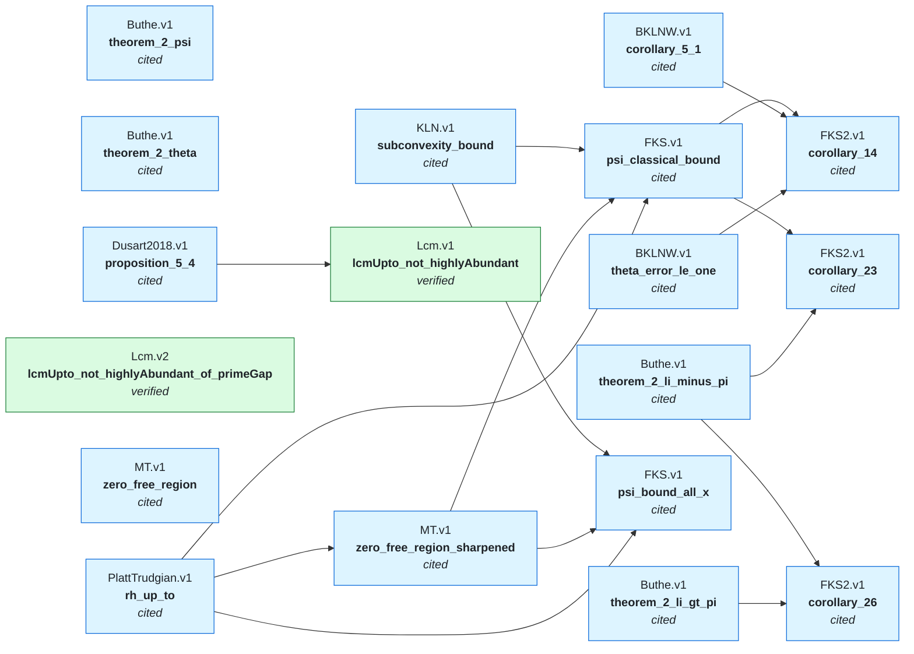

# The network

**Generated file - do not edit.**  Regenerated by `python scripts/ieantn.py graph`.

Each **node** makes a mathematical claim, declares what it assumes, and carries evidence
for the step from its assumptions to its claim. An arrow `A --> B` means *B assumes A*:
B's claim is conditional on A's, and B's own evidence covers only the step.

The colour of a box is the kind of evidence, and only green is checked by Lean here.
Everything else is a leaf of the trust graph -- something the network takes on faith,
however reasonably -- and the point of drawing it is that you can see exactly which.

## What each result rests on

Only the conclusions nothing else imports are listed; the rest appear inside them.
A line is one claim, indented under whatever assumes it.

- `Buthe.v1.theorem_2_psi` — cited

- `Buthe.v1.theorem_2_theta` — cited

- `FKS.v1.psi_bound_all_x` — cited
  - `KLN.v1.subconvexity_bound` — cited
  - `MT.v1.zero_free_region_sharpened` — cited
    - `PlattTrudgian.v1.rh_up_to` — cited
  - `PlattTrudgian.v1.rh_up_to` — cited *(above)*

- `FKS2.v1.corollary_14` — cited
  - `FKS.v1.psi_classical_bound` — cited
    - `KLN.v1.subconvexity_bound` — cited
    - `MT.v1.zero_free_region_sharpened` — cited
      - `PlattTrudgian.v1.rh_up_to` — cited
    - `PlattTrudgian.v1.rh_up_to` — cited *(above)*
  - `BKLNW.v1.corollary_5_1` — cited
  - `BKLNW.v1.theta_error_le_one` — cited

- `FKS2.v1.corollary_23` — cited
  - `FKS.v1.psi_classical_bound` — cited
    - `KLN.v1.subconvexity_bound` — cited
    - `MT.v1.zero_free_region_sharpened` — cited
      - `PlattTrudgian.v1.rh_up_to` — cited
    - `PlattTrudgian.v1.rh_up_to` — cited *(above)*
  - `Buthe.v1.theorem_2_li_minus_pi` — cited

- `FKS2.v1.corollary_26` — cited
  - `Buthe.v1.theorem_2_li_minus_pi` — cited
  - `Buthe.v1.theorem_2_li_gt_pi` — cited

- `Lcm.v1.lcmUpto_not_highlyAbundant` — verified
  - `Dusart2018.v1.proposition_5_4` — cited

- `Lcm.v2.lcmUpto_not_highlyAbundant_of_primeGap` — verified

- `MT.v1.zero_free_region` — cited

## What the network takes on trust

Every claim above that Lean has not checked here, ordered by how much depends on it.
This table is the honest answer to "how good is the evidence", and it is computed
rather than maintained.

| Claim | Evidence | Depended on by |
|---|---|---:|
| `PlattTrudgian.v1.rh_up_to` | cited | 3 |
| `Buthe.v1.theorem_2_li_minus_pi` | cited | 2 |
| `FKS.v1.psi_classical_bound` | cited | 2 |
| `KLN.v1.subconvexity_bound` | cited | 2 |
| `MT.v1.zero_free_region_sharpened` | cited | 2 |
| `BKLNW.v1.corollary_5_1` | cited | 1 |
| `BKLNW.v1.theta_error_le_one` | cited | 1 |
| `Buthe.v1.theorem_2_li_gt_pi` | cited | 1 |
| `Dusart2018.v1.proposition_5_4` | cited | 1 |
| `Buthe.v1.theorem_2_psi` | cited | 0 |
| `Buthe.v1.theorem_2_theta` | cited | 0 |
| `FKS.v1.psi_bound_all_x` | cited | 0 |
| `FKS2.v1.corollary_14` | cited | 0 |
| `FKS2.v1.corollary_23` | cited | 0 |
| `FKS2.v1.corollary_26` | cited | 0 |
| `MT.v1.zero_free_region` | cited | 0 |

## Nodes that state nothing yet

A paper recorded as in scope, before anyone has transcribed a claim from it. These are
the network's open invitations.

- `Kadiri2005.v1`
- `MTY.v1`
- `RosserSchoenfeld.v1`

---

See [STATE.md](STATE.md) for the same content as a table, [docs/ARCHITECTURE.md](docs/ARCHITECTURE.md)
for why the network is shaped this way, and `python scripts/ieantn.py status` for how
fresh each Lean verification is.
