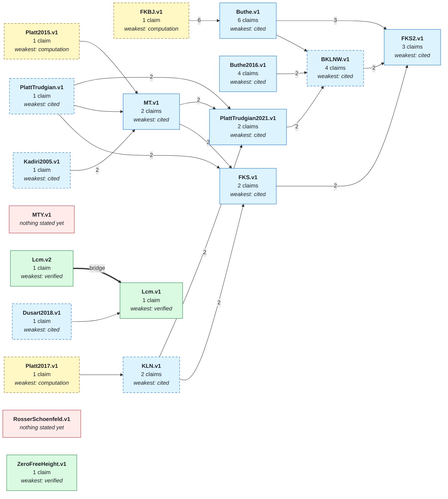

# The network

**Generated file - do not edit.**  Regenerated by `python scripts/ieantn.py graph`.

Each **node** makes a mathematical claim, declares what it assumes, and carries evidence
for the step from its assumptions to its claim. An arrow `A --> B` means *B assumes A*:
B's claim is conditional on A's, and B's own evidence covers only the step.

The colour of a box is the kind of evidence, and only green is checked by Lean here.
Everything else is a leaf of the trust graph -- something the network takes on faith,
however reasonably -- and the point of drawing it is that you can see exactly which.

A **dashed** border means nobody has yet worked out what that claim itself assumes. It is
not a claim that the box rests on nothing; it is an admission that the question has not
been asked. A solid border means someone has traced it to its sources, and the arrows
into it are the answer.

Every box and every claim named below links to that node's page, which carries the Lean
spelling of the claim, its docstring, and everything recorded about why it should be
believed. The pages are indexed at [docs/nodes/](docs/nodes/README.md).

A **hexagon** is a *bridge*, and the thick arrows around it are a different relation from
the thin ones. A thin arrow into a box means the box **assumes** what the arrow comes
from, and nothing here checks the step. A bridge is the step itself, proved in Lean and
recompiled on every push. It is drawn as a box rather than an arrow because a bridge may
have several premises at once, which an arrow cannot say. A bridge marked *spare* is a
second ground for a claim that is currently justified some other way.

## The network at a glance

One box per node, so this stays readable as the network grows. The number on a thin arrow
is how many separate claims cross it. A node is coloured by its **weakest** conclusion,
since that is what someone importing the whole node is relying on, and dashed if any of
its claims has not been traced to its own sources.

A thick **bridge** arrow is a Lean-checked implication rather than an assumption. At this
resolution it says only that some bridge crosses between the two nodes; which premises a
bridge needed together is in the detailed picture below.

## Every claim

The same graph at full resolution, grouped by node. This is the one that is true rather
than the one that is legible; when they disagree, believe this one.

```mermaid
graph LR
  subgraph sgBKLNW_v1["BKLNW.v1"]
    BKLNW_v1_corollary_5_1["<b>corollary_5_1</b><br/><i>cited</i>"]
    BKLNW_v1_table8_psi_bound["<b>table8_psi_bound</b><br/><i>cited</i>"]
    BKLNW_v1_table8_psi_bound_above["<b>table8_psi_bound_above</b><br/><i>cited</i>"]
    BKLNW_v1_theta_error_le_one["<b>theta_error_le_one</b><br/><i>cited</i>"]
  end
  subgraph sgButhe_v1["Buthe.v1"]
    Buthe_v1_theorem_2_li_gt_pi["<b>theorem_2_li_gt_pi</b><br/><i>cited</i>"]
    Buthe_v1_theorem_2_li_minus_pi["<b>theorem_2_li_minus_pi</b><br/><i>cited</i>"]
    Buthe_v1_theorem_2_li_minus_riemann_pi["<b>theorem_2_li_minus_riemann_pi</b><br/><i>cited</i>"]
    Buthe_v1_theorem_2_psi["<b>theorem_2_psi</b><br/><i>cited</i>"]
    Buthe_v1_theorem_2_theta["<b>theorem_2_theta</b><br/><i>cited</i>"]
    Buthe_v1_theorem_2_theta_lower["<b>theorem_2_theta_lower</b><br/><i>cited</i>"]
  end
  subgraph sgButhe2016_v1["Buthe2016.v1"]
    Buthe2016_v1_theorem_2_li_minus_pi["<b>theorem_2_li_minus_pi</b><br/><i>cited</i>"]
    Buthe2016_v1_theorem_2_li_minus_riemann_pi["<b>theorem_2_li_minus_riemann_pi</b><br/><i>cited</i>"]
    Buthe2016_v1_theorem_2_psi["<b>theorem_2_psi</b><br/><i>cited</i>"]
    Buthe2016_v1_theorem_2_theta["<b>theorem_2_theta</b><br/><i>cited</i>"]
  end
  subgraph sgDusart2018_v1["Dusart2018.v1"]
    Dusart2018_v1_proposition_5_4["<b>proposition_5_4</b><br/><i>cited</i>"]
  end
  subgraph sgFKBJ_v1["FKBJ.v1"]
    FKBJ_v1_rh_up_to["<b>rh_up_to</b><br/><i>computation</i>"]
  end
  subgraph sgFKS_v1["FKS.v1"]
    FKS_v1_psi_bound_all_x["<b>psi_bound_all_x</b><br/><i>cited</i>"]
    FKS_v1_psi_classical_bound["<b>psi_classical_bound</b><br/><i>cited</i>"]
  end
  subgraph sgFKS2_v1["FKS2.v1"]
    FKS2_v1_corollary_14["<b>corollary_14</b><br/><i>cited</i>"]
    FKS2_v1_corollary_23["<b>corollary_23</b><br/><i>cited</i>"]
    FKS2_v1_corollary_26["<b>corollary_26</b><br/><i>cited</i>"]
  end
  subgraph sgKLN_v1["KLN.v1"]
    KLN_v1_subconvexity_bound["<b>subconvexity_bound</b><br/><i>cited</i>"]
    KLN_v1_zero_density["<b>zero_density</b><br/><i>cited</i>"]
  end
  subgraph sgKadiri2005_v1["Kadiri2005.v1"]
    Kadiri2005_v1_zero_free_region["<b>zero_free_region</b><br/><i>cited</i>"]
  end
  subgraph sgLcm_v1["Lcm.v1"]
    Lcm_v1_lcmUpto_not_highlyAbundant["<b>lcmUpto_not_highlyAbundant</b><br/><i>verified</i>"]
  end
  subgraph sgLcm_v2["Lcm.v2"]
    Lcm_v2_lcmUpto_not_highlyAbundant_of_primeGap["<b>lcmUpto_not_highlyAbundant_of_primeGap</b><br/><i>verified</i>"]
  end
  subgraph sgMT_v1["MT.v1"]
    MT_v1_zero_free_region["<b>zero_free_region</b><br/><i>cited</i>"]
    MT_v1_zero_free_region_sharpened["<b>zero_free_region_sharpened</b><br/><i>cited</i>"]
  end
  subgraph sgPlatt2015_v1["Platt2015.v1"]
    Platt2015_v1_rh_up_to["<b>rh_up_to</b><br/><i>computation</i>"]
  end
  subgraph sgPlatt2017_v1["Platt2017.v1"]
    Platt2017_v1_rh_up_to["<b>rh_up_to</b><br/><i>computation</i>"]
  end
  subgraph sgPlattTrudgian_v1["PlattTrudgian.v1"]
    PlattTrudgian_v1_rh_up_to["<b>rh_up_to</b><br/><i>cited</i>"]
  end
  subgraph sgPlattTrudgian2021_v1["PlattTrudgian2021.v1"]
    PlattTrudgian2021_v1_theorem_1_classical["<b>theorem_1_classical</b><br/><i>cited</i>"]
    PlattTrudgian2021_v1_theorem_1_numerical["<b>theorem_1_numerical</b><br/><i>cited</i>"]
  end
  subgraph sgZeroFreeHeight_v1["ZeroFreeHeight.v1"]
    ZeroFreeHeight_v1_classical_region_descends["<b>classical_region_descends</b><br/><i>verified</i>"]
  end
  Buthe_v1_theorem_2_theta_lower --> BKLNW_v1_corollary_5_1
  Buthe2016_v1_theorem_2_psi --> BKLNW_v1_table8_psi_bound
  PlattTrudgian2021_v1_theorem_1_numerical --> BKLNW_v1_table8_psi_bound
  Buthe2016_v1_theorem_2_psi --> BKLNW_v1_table8_psi_bound_above
  PlattTrudgian2021_v1_theorem_1_numerical --> BKLNW_v1_table8_psi_bound_above
  FKBJ_v1_rh_up_to --> Buthe_v1_theorem_2_li_gt_pi
  FKBJ_v1_rh_up_to --> Buthe_v1_theorem_2_li_minus_pi
  FKBJ_v1_rh_up_to --> Buthe_v1_theorem_2_li_minus_riemann_pi
  FKBJ_v1_rh_up_to --> Buthe_v1_theorem_2_psi
  FKBJ_v1_rh_up_to --> Buthe_v1_theorem_2_theta
  FKBJ_v1_rh_up_to --> Buthe_v1_theorem_2_theta_lower
  KLN_v1_subconvexity_bound --> FKS_v1_psi_bound_all_x
  MT_v1_zero_free_region_sharpened --> FKS_v1_psi_bound_all_x
  PlattTrudgian_v1_rh_up_to --> FKS_v1_psi_bound_all_x
  KLN_v1_subconvexity_bound --> FKS_v1_psi_classical_bound
  MT_v1_zero_free_region_sharpened --> FKS_v1_psi_classical_bound
  PlattTrudgian_v1_rh_up_to --> FKS_v1_psi_classical_bound
  FKS_v1_psi_classical_bound --> FKS2_v1_corollary_14
  BKLNW_v1_corollary_5_1 --> FKS2_v1_corollary_14
  BKLNW_v1_theta_error_le_one --> FKS2_v1_corollary_14
  FKS_v1_psi_classical_bound --> FKS2_v1_corollary_23
  Buthe_v1_theorem_2_li_minus_pi --> FKS2_v1_corollary_23
  Buthe_v1_theorem_2_li_minus_pi --> FKS2_v1_corollary_26
  Buthe_v1_theorem_2_li_gt_pi --> FKS2_v1_corollary_26
  Platt2017_v1_rh_up_to --> KLN_v1_zero_density
  Dusart2018_v1_proposition_5_4 --> Lcm_v1_lcmUpto_not_highlyAbundant
  Kadiri2005_v1_zero_free_region --> MT_v1_zero_free_region
  Platt2015_v1_rh_up_to --> MT_v1_zero_free_region
  Kadiri2005_v1_zero_free_region --> MT_v1_zero_free_region_sharpened
  PlattTrudgian_v1_rh_up_to --> MT_v1_zero_free_region_sharpened
  MT_v1_zero_free_region --> PlattTrudgian2021_v1_theorem_1_classical
  PlattTrudgian_v1_rh_up_to --> PlattTrudgian2021_v1_theorem_1_classical
  KLN_v1_zero_density --> PlattTrudgian2021_v1_theorem_1_classical
  MT_v1_zero_free_region --> PlattTrudgian2021_v1_theorem_1_numerical
  PlattTrudgian_v1_rh_up_to --> PlattTrudgian2021_v1_theorem_1_numerical
  KLN_v1_zero_density --> PlattTrudgian2021_v1_theorem_1_numerical
  BRLcm_v1_lcmUpto_not_highlyAbundant__bridge_from_v2{{"<b>V2ToV1</b><br/><i>spare</i>"}}
  Lcm_v2_lcmUpto_not_highlyAbundant_of_primeGap ==> BRLcm_v1_lcmUpto_not_highlyAbundant__bridge_from_v2
  BRLcm_v1_lcmUpto_not_highlyAbundant__bridge_from_v2 ==> Lcm_v1_lcmUpto_not_highlyAbundant
  style BKLNW_v1_theta_error_le_one stroke-dasharray: 6 4;
  style Dusart2018_v1_proposition_5_4 stroke-dasharray: 6 4;
  style FKBJ_v1_rh_up_to stroke-dasharray: 6 4;
  style KLN_v1_subconvexity_bound stroke-dasharray: 6 4;
  style Kadiri2005_v1_zero_free_region stroke-dasharray: 6 4;
  style Platt2015_v1_rh_up_to stroke-dasharray: 6 4;
  style Platt2017_v1_rh_up_to stroke-dasharray: 6 4;
  style PlattTrudgian_v1_rh_up_to stroke-dasharray: 6 4;
  classDef lean_comparator fill:#dafbe1,stroke:#1a7f37,color:#1f2328;
  classDef numerical fill:#fff8c5,stroke:#9a6700,color:#1f2328;
  classDef literature fill:#ddf4ff,stroke:#0969da,color:#1f2328;
  classDef asserted fill:#fff1e5,stroke:#bc4c00,color:#1f2328;
  classDef bridged fill:#fbefff,stroke:#8250df,color:#1f2328;
  classDef none_yet fill:#ffebe9,stroke:#cf222e,color:#1f2328;
  classDef bridge fill:#fbefff,stroke:#8250df,color:#1f2328,stroke-width:2px;
  class BRLcm_v1_lcmUpto_not_highlyAbundant__bridge_from_v2 bridge;
  class Lcm_v1_lcmUpto_not_highlyAbundant,Lcm_v2_lcmUpto_not_highlyAbundant_of_primeGap,ZeroFreeHeight_v1_classical_region_descends lean_comparator;
  class BKLNW_v1_corollary_5_1,BKLNW_v1_table8_psi_bound,BKLNW_v1_table8_psi_bound_above,BKLNW_v1_theta_error_le_one,Buthe_v1_theorem_2_li_gt_pi,Buthe_v1_theorem_2_li_minus_pi,Buthe_v1_theorem_2_li_minus_riemann_pi,Buthe_v1_theorem_2_psi,Buthe_v1_theorem_2_theta,Buthe_v1_theorem_2_theta_lower,Buthe2016_v1_theorem_2_li_minus_pi,Buthe2016_v1_theorem_2_li_minus_riemann_pi,Buthe2016_v1_theorem_2_psi,Buthe2016_v1_theorem_2_theta,Dusart2018_v1_proposition_5_4,FKS_v1_psi_bound_all_x,FKS_v1_psi_classical_bound,FKS2_v1_corollary_14,FKS2_v1_corollary_23,FKS2_v1_corollary_26,KLN_v1_subconvexity_bound,KLN_v1_zero_density,Kadiri2005_v1_zero_free_region,MT_v1_zero_free_region,MT_v1_zero_free_region_sharpened,PlattTrudgian_v1_rh_up_to,PlattTrudgian2021_v1_theorem_1_classical,PlattTrudgian2021_v1_theorem_1_numerical literature;
  class FKBJ_v1_rh_up_to,Platt2015_v1_rh_up_to,Platt2017_v1_rh_up_to numerical;
  click BKLNW_v1_corollary_5_1 href "https://github.com/teorth/IEANTN/blob/main/docs/nodes/BKLNW-v1.md#corollary_5_1" _blank
  click BKLNW_v1_table8_psi_bound href "https://github.com/teorth/IEANTN/blob/main/docs/nodes/BKLNW-v1.md#table8_psi_bound" _blank
  click BKLNW_v1_table8_psi_bound_above href "https://github.com/teorth/IEANTN/blob/main/docs/nodes/BKLNW-v1.md#table8_psi_bound_above" _blank
  click BKLNW_v1_theta_error_le_one href "https://github.com/teorth/IEANTN/blob/main/docs/nodes/BKLNW-v1.md#theta_error_le_one" _blank
  click Buthe_v1_theorem_2_li_gt_pi href "https://github.com/teorth/IEANTN/blob/main/docs/nodes/Buthe-v1.md#theorem_2_li_gt_pi" _blank
  click Buthe_v1_theorem_2_li_minus_pi href "https://github.com/teorth/IEANTN/blob/main/docs/nodes/Buthe-v1.md#theorem_2_li_minus_pi" _blank
  click Buthe_v1_theorem_2_li_minus_riemann_pi href "https://github.com/teorth/IEANTN/blob/main/docs/nodes/Buthe-v1.md#theorem_2_li_minus_riemann_pi" _blank
  click Buthe_v1_theorem_2_psi href "https://github.com/teorth/IEANTN/blob/main/docs/nodes/Buthe-v1.md#theorem_2_psi" _blank
  click Buthe_v1_theorem_2_theta href "https://github.com/teorth/IEANTN/blob/main/docs/nodes/Buthe-v1.md#theorem_2_theta" _blank
  click Buthe_v1_theorem_2_theta_lower href "https://github.com/teorth/IEANTN/blob/main/docs/nodes/Buthe-v1.md#theorem_2_theta_lower" _blank
  click Buthe2016_v1_theorem_2_li_minus_pi href "https://github.com/teorth/IEANTN/blob/main/docs/nodes/Buthe2016-v1.md#theorem_2_li_minus_pi" _blank
  click Buthe2016_v1_theorem_2_li_minus_riemann_pi href "https://github.com/teorth/IEANTN/blob/main/docs/nodes/Buthe2016-v1.md#theorem_2_li_minus_riemann_pi" _blank
  click Buthe2016_v1_theorem_2_psi href "https://github.com/teorth/IEANTN/blob/main/docs/nodes/Buthe2016-v1.md#theorem_2_psi" _blank
  click Buthe2016_v1_theorem_2_theta href "https://github.com/teorth/IEANTN/blob/main/docs/nodes/Buthe2016-v1.md#theorem_2_theta" _blank
  click Dusart2018_v1_proposition_5_4 href "https://github.com/teorth/IEANTN/blob/main/docs/nodes/Dusart2018-v1.md#proposition_5_4" _blank
  click FKBJ_v1_rh_up_to href "https://github.com/teorth/IEANTN/blob/main/docs/nodes/FKBJ-v1.md#rh_up_to" _blank
  click FKS_v1_psi_bound_all_x href "https://github.com/teorth/IEANTN/blob/main/docs/nodes/FKS-v1.md#psi_bound_all_x" _blank
  click FKS_v1_psi_classical_bound href "https://github.com/teorth/IEANTN/blob/main/docs/nodes/FKS-v1.md#psi_classical_bound" _blank
  click FKS2_v1_corollary_14 href "https://github.com/teorth/IEANTN/blob/main/docs/nodes/FKS2-v1.md#corollary_14" _blank
  click FKS2_v1_corollary_23 href "https://github.com/teorth/IEANTN/blob/main/docs/nodes/FKS2-v1.md#corollary_23" _blank
  click FKS2_v1_corollary_26 href "https://github.com/teorth/IEANTN/blob/main/docs/nodes/FKS2-v1.md#corollary_26" _blank
  click KLN_v1_subconvexity_bound href "https://github.com/teorth/IEANTN/blob/main/docs/nodes/KLN-v1.md#subconvexity_bound" _blank
  click KLN_v1_zero_density href "https://github.com/teorth/IEANTN/blob/main/docs/nodes/KLN-v1.md#zero_density" _blank
  click Kadiri2005_v1_zero_free_region href "https://github.com/teorth/IEANTN/blob/main/docs/nodes/Kadiri2005-v1.md#zero_free_region" _blank
  click Lcm_v1_lcmUpto_not_highlyAbundant href "https://github.com/teorth/IEANTN/blob/main/docs/nodes/Lcm-v1.md#lcmUpto_not_highlyAbundant" _blank
  click Lcm_v2_lcmUpto_not_highlyAbundant_of_primeGap href "https://github.com/teorth/IEANTN/blob/main/docs/nodes/Lcm-v2.md#lcmUpto_not_highlyAbundant_of_primeGap" _blank
  click MT_v1_zero_free_region href "https://github.com/teorth/IEANTN/blob/main/docs/nodes/MT-v1.md#zero_free_region" _blank
  click MT_v1_zero_free_region_sharpened href "https://github.com/teorth/IEANTN/blob/main/docs/nodes/MT-v1.md#zero_free_region_sharpened" _blank
  click Platt2015_v1_rh_up_to href "https://github.com/teorth/IEANTN/blob/main/docs/nodes/Platt2015-v1.md#rh_up_to" _blank
  click Platt2017_v1_rh_up_to href "https://github.com/teorth/IEANTN/blob/main/docs/nodes/Platt2017-v1.md#rh_up_to" _blank
  click PlattTrudgian_v1_rh_up_to href "https://github.com/teorth/IEANTN/blob/main/docs/nodes/PlattTrudgian-v1.md#rh_up_to" _blank
  click PlattTrudgian2021_v1_theorem_1_classical href "https://github.com/teorth/IEANTN/blob/main/docs/nodes/PlattTrudgian2021-v1.md#theorem_1_classical" _blank
  click PlattTrudgian2021_v1_theorem_1_numerical href "https://github.com/teorth/IEANTN/blob/main/docs/nodes/PlattTrudgian2021-v1.md#theorem_1_numerical" _blank
  click ZeroFreeHeight_v1_classical_region_descends href "https://github.com/teorth/IEANTN/blob/main/docs/nodes/ZeroFreeHeight-v1.md#classical_region_descends" _blank
```

## What each result rests on

Only the conclusions nothing else imports are listed; the rest appear inside them.
A line is one claim, indented under whatever assumes it.

- [`BKLNW.v1.table8_psi_bound`](docs/nodes/BKLNW-v1.md#table8_psi_bound) — cited
  - [`Buthe2016.v1.theorem_2_psi`](docs/nodes/Buthe2016-v1.md#theorem_2_psi) — cited
  - [`PlattTrudgian2021.v1.theorem_1_numerical`](docs/nodes/PlattTrudgian2021-v1.md#theorem_1_numerical) — cited
    - [`MT.v1.zero_free_region`](docs/nodes/MT-v1.md#zero_free_region) — cited
      - [`Kadiri2005.v1.zero_free_region`](docs/nodes/Kadiri2005-v1.md#zero_free_region) — cited — *sources not traced*
      - [`Platt2015.v1.rh_up_to`](docs/nodes/Platt2015-v1.md#rh_up_to) — computation — *sources not traced*
    - [`PlattTrudgian.v1.rh_up_to`](docs/nodes/PlattTrudgian-v1.md#rh_up_to) — cited — *sources not traced*
    - [`KLN.v1.zero_density`](docs/nodes/KLN-v1.md#zero_density) — cited
      - [`Platt2017.v1.rh_up_to`](docs/nodes/Platt2017-v1.md#rh_up_to) — computation — *sources not traced*

- [`BKLNW.v1.table8_psi_bound_above`](docs/nodes/BKLNW-v1.md#table8_psi_bound_above) — cited
  - [`Buthe2016.v1.theorem_2_psi`](docs/nodes/Buthe2016-v1.md#theorem_2_psi) — cited
  - [`PlattTrudgian2021.v1.theorem_1_numerical`](docs/nodes/PlattTrudgian2021-v1.md#theorem_1_numerical) — cited
    - [`MT.v1.zero_free_region`](docs/nodes/MT-v1.md#zero_free_region) — cited
      - [`Kadiri2005.v1.zero_free_region`](docs/nodes/Kadiri2005-v1.md#zero_free_region) — cited — *sources not traced*
      - [`Platt2015.v1.rh_up_to`](docs/nodes/Platt2015-v1.md#rh_up_to) — computation — *sources not traced*
    - [`PlattTrudgian.v1.rh_up_to`](docs/nodes/PlattTrudgian-v1.md#rh_up_to) — cited — *sources not traced*
    - [`KLN.v1.zero_density`](docs/nodes/KLN-v1.md#zero_density) — cited
      - [`Platt2017.v1.rh_up_to`](docs/nodes/Platt2017-v1.md#rh_up_to) — computation — *sources not traced*

- [`Buthe.v1.theorem_2_li_minus_riemann_pi`](docs/nodes/Buthe-v1.md#theorem_2_li_minus_riemann_pi) — cited
  - [`FKBJ.v1.rh_up_to`](docs/nodes/FKBJ-v1.md#rh_up_to) — computation — *sources not traced*

- [`Buthe.v1.theorem_2_psi`](docs/nodes/Buthe-v1.md#theorem_2_psi) — cited
  - [`FKBJ.v1.rh_up_to`](docs/nodes/FKBJ-v1.md#rh_up_to) — computation — *sources not traced*

- [`Buthe.v1.theorem_2_theta`](docs/nodes/Buthe-v1.md#theorem_2_theta) — cited
  - [`FKBJ.v1.rh_up_to`](docs/nodes/FKBJ-v1.md#rh_up_to) — computation — *sources not traced*

- [`Buthe2016.v1.theorem_2_li_minus_pi`](docs/nodes/Buthe2016-v1.md#theorem_2_li_minus_pi) — cited

- [`Buthe2016.v1.theorem_2_li_minus_riemann_pi`](docs/nodes/Buthe2016-v1.md#theorem_2_li_minus_riemann_pi) — cited

- [`Buthe2016.v1.theorem_2_theta`](docs/nodes/Buthe2016-v1.md#theorem_2_theta) — cited

- [`FKS.v1.psi_bound_all_x`](docs/nodes/FKS-v1.md#psi_bound_all_x) — cited
  - [`KLN.v1.subconvexity_bound`](docs/nodes/KLN-v1.md#subconvexity_bound) — cited — *sources not traced*
  - [`MT.v1.zero_free_region_sharpened`](docs/nodes/MT-v1.md#zero_free_region_sharpened) — cited
    - [`Kadiri2005.v1.zero_free_region`](docs/nodes/Kadiri2005-v1.md#zero_free_region) — cited — *sources not traced*
    - [`PlattTrudgian.v1.rh_up_to`](docs/nodes/PlattTrudgian-v1.md#rh_up_to) — cited — *sources not traced*
  - [`PlattTrudgian.v1.rh_up_to`](docs/nodes/PlattTrudgian-v1.md#rh_up_to) — cited *(above)* — *sources not traced*

- [`FKS2.v1.corollary_14`](docs/nodes/FKS2-v1.md#corollary_14) — cited
  - [`FKS.v1.psi_classical_bound`](docs/nodes/FKS-v1.md#psi_classical_bound) — cited
    - [`KLN.v1.subconvexity_bound`](docs/nodes/KLN-v1.md#subconvexity_bound) — cited — *sources not traced*
    - [`MT.v1.zero_free_region_sharpened`](docs/nodes/MT-v1.md#zero_free_region_sharpened) — cited
      - [`Kadiri2005.v1.zero_free_region`](docs/nodes/Kadiri2005-v1.md#zero_free_region) — cited — *sources not traced*
      - [`PlattTrudgian.v1.rh_up_to`](docs/nodes/PlattTrudgian-v1.md#rh_up_to) — cited — *sources not traced*
    - [`PlattTrudgian.v1.rh_up_to`](docs/nodes/PlattTrudgian-v1.md#rh_up_to) — cited *(above)* — *sources not traced*
  - [`BKLNW.v1.corollary_5_1`](docs/nodes/BKLNW-v1.md#corollary_5_1) — cited
    - [`Buthe.v1.theorem_2_theta_lower`](docs/nodes/Buthe-v1.md#theorem_2_theta_lower) — cited
      - [`FKBJ.v1.rh_up_to`](docs/nodes/FKBJ-v1.md#rh_up_to) — computation — *sources not traced*
  - [`BKLNW.v1.theta_error_le_one`](docs/nodes/BKLNW-v1.md#theta_error_le_one) — cited — *sources not traced*

- [`FKS2.v1.corollary_23`](docs/nodes/FKS2-v1.md#corollary_23) — cited
  - [`FKS.v1.psi_classical_bound`](docs/nodes/FKS-v1.md#psi_classical_bound) — cited
    - [`KLN.v1.subconvexity_bound`](docs/nodes/KLN-v1.md#subconvexity_bound) — cited — *sources not traced*
    - [`MT.v1.zero_free_region_sharpened`](docs/nodes/MT-v1.md#zero_free_region_sharpened) — cited
      - [`Kadiri2005.v1.zero_free_region`](docs/nodes/Kadiri2005-v1.md#zero_free_region) — cited — *sources not traced*
      - [`PlattTrudgian.v1.rh_up_to`](docs/nodes/PlattTrudgian-v1.md#rh_up_to) — cited — *sources not traced*
    - [`PlattTrudgian.v1.rh_up_to`](docs/nodes/PlattTrudgian-v1.md#rh_up_to) — cited *(above)* — *sources not traced*
  - [`Buthe.v1.theorem_2_li_minus_pi`](docs/nodes/Buthe-v1.md#theorem_2_li_minus_pi) — cited
    - [`FKBJ.v1.rh_up_to`](docs/nodes/FKBJ-v1.md#rh_up_to) — computation — *sources not traced*

- [`FKS2.v1.corollary_26`](docs/nodes/FKS2-v1.md#corollary_26) — cited
  - [`Buthe.v1.theorem_2_li_minus_pi`](docs/nodes/Buthe-v1.md#theorem_2_li_minus_pi) — cited
    - [`FKBJ.v1.rh_up_to`](docs/nodes/FKBJ-v1.md#rh_up_to) — computation — *sources not traced*
  - [`Buthe.v1.theorem_2_li_gt_pi`](docs/nodes/Buthe-v1.md#theorem_2_li_gt_pi) — cited
    - [`FKBJ.v1.rh_up_to`](docs/nodes/FKBJ-v1.md#rh_up_to) — computation *(above)* — *sources not traced*

- [`Lcm.v1.lcmUpto_not_highlyAbundant`](docs/nodes/Lcm-v1.md#lcmUpto_not_highlyAbundant) — verified
  - [`Dusart2018.v1.proposition_5_4`](docs/nodes/Dusart2018-v1.md#proposition_5_4) — cited — *sources not traced*

- [`Lcm.v2.lcmUpto_not_highlyAbundant_of_primeGap`](docs/nodes/Lcm-v2.md#lcmUpto_not_highlyAbundant_of_primeGap) — verified

- [`PlattTrudgian2021.v1.theorem_1_classical`](docs/nodes/PlattTrudgian2021-v1.md#theorem_1_classical) — cited
  - [`MT.v1.zero_free_region`](docs/nodes/MT-v1.md#zero_free_region) — cited
    - [`Kadiri2005.v1.zero_free_region`](docs/nodes/Kadiri2005-v1.md#zero_free_region) — cited — *sources not traced*
    - [`Platt2015.v1.rh_up_to`](docs/nodes/Platt2015-v1.md#rh_up_to) — computation — *sources not traced*
  - [`PlattTrudgian.v1.rh_up_to`](docs/nodes/PlattTrudgian-v1.md#rh_up_to) — cited — *sources not traced*
  - [`KLN.v1.zero_density`](docs/nodes/KLN-v1.md#zero_density) — cited
    - [`Platt2017.v1.rh_up_to`](docs/nodes/Platt2017-v1.md#rh_up_to) — computation — *sources not traced*

- [`ZeroFreeHeight.v1.classical_region_descends`](docs/nodes/ZeroFreeHeight-v1.md#classical_region_descends) — verified

## What the network takes on trust

Every claim above that Lean has not checked here, ordered by how much depends on it.
This table is the honest answer to "how good is the evidence", and it is computed
rather than maintained.

| Claim | Evidence | Depended on by | Its own sources |
|---|---|---:|---|
| [`FKBJ.v1.rh_up_to`](docs/nodes/FKBJ-v1.md#rh_up_to) | computation | 6 | **not yet traced** |
| [`PlattTrudgian.v1.rh_up_to`](docs/nodes/PlattTrudgian-v1.md#rh_up_to) | cited | 5 | **not yet traced** |
| [`Buthe.v1.theorem_2_li_minus_pi`](docs/nodes/Buthe-v1.md#theorem_2_li_minus_pi) | cited | 2 | traced |
| [`Buthe2016.v1.theorem_2_psi`](docs/nodes/Buthe2016-v1.md#theorem_2_psi) | cited | 2 | traced |
| [`FKS.v1.psi_classical_bound`](docs/nodes/FKS-v1.md#psi_classical_bound) | cited | 2 | traced |
| [`KLN.v1.subconvexity_bound`](docs/nodes/KLN-v1.md#subconvexity_bound) | cited | 2 | **not yet traced** |
| [`KLN.v1.zero_density`](docs/nodes/KLN-v1.md#zero_density) | cited | 2 | traced |
| [`Kadiri2005.v1.zero_free_region`](docs/nodes/Kadiri2005-v1.md#zero_free_region) | cited | 2 | **not yet traced** |
| [`MT.v1.zero_free_region`](docs/nodes/MT-v1.md#zero_free_region) | cited | 2 | traced |
| [`MT.v1.zero_free_region_sharpened`](docs/nodes/MT-v1.md#zero_free_region_sharpened) | cited | 2 | traced |
| [`PlattTrudgian2021.v1.theorem_1_numerical`](docs/nodes/PlattTrudgian2021-v1.md#theorem_1_numerical) | cited | 2 | traced |
| [`BKLNW.v1.corollary_5_1`](docs/nodes/BKLNW-v1.md#corollary_5_1) | cited | 1 | traced |
| [`BKLNW.v1.theta_error_le_one`](docs/nodes/BKLNW-v1.md#theta_error_le_one) | cited | 1 | **not yet traced** |
| [`Buthe.v1.theorem_2_li_gt_pi`](docs/nodes/Buthe-v1.md#theorem_2_li_gt_pi) | cited | 1 | traced |
| [`Buthe.v1.theorem_2_theta_lower`](docs/nodes/Buthe-v1.md#theorem_2_theta_lower) | cited | 1 | traced |
| [`Dusart2018.v1.proposition_5_4`](docs/nodes/Dusart2018-v1.md#proposition_5_4) | cited | 1 | **not yet traced** |
| [`Platt2015.v1.rh_up_to`](docs/nodes/Platt2015-v1.md#rh_up_to) | computation | 1 | **not yet traced** |
| [`Platt2017.v1.rh_up_to`](docs/nodes/Platt2017-v1.md#rh_up_to) | computation | 1 | **not yet traced** |
| [`BKLNW.v1.table8_psi_bound`](docs/nodes/BKLNW-v1.md#table8_psi_bound) | cited | 0 | traced |
| [`BKLNW.v1.table8_psi_bound_above`](docs/nodes/BKLNW-v1.md#table8_psi_bound_above) | cited | 0 | traced |
| [`Buthe.v1.theorem_2_li_minus_riemann_pi`](docs/nodes/Buthe-v1.md#theorem_2_li_minus_riemann_pi) | cited | 0 | traced |
| [`Buthe.v1.theorem_2_psi`](docs/nodes/Buthe-v1.md#theorem_2_psi) | cited | 0 | traced |
| [`Buthe.v1.theorem_2_theta`](docs/nodes/Buthe-v1.md#theorem_2_theta) | cited | 0 | traced |
| [`Buthe2016.v1.theorem_2_li_minus_pi`](docs/nodes/Buthe2016-v1.md#theorem_2_li_minus_pi) | cited | 0 | traced |
| [`Buthe2016.v1.theorem_2_li_minus_riemann_pi`](docs/nodes/Buthe2016-v1.md#theorem_2_li_minus_riemann_pi) | cited | 0 | traced |
| [`Buthe2016.v1.theorem_2_theta`](docs/nodes/Buthe2016-v1.md#theorem_2_theta) | cited | 0 | traced |
| [`FKS.v1.psi_bound_all_x`](docs/nodes/FKS-v1.md#psi_bound_all_x) | cited | 0 | traced |
| [`FKS2.v1.corollary_14`](docs/nodes/FKS2-v1.md#corollary_14) | cited | 0 | traced |
| [`FKS2.v1.corollary_23`](docs/nodes/FKS2-v1.md#corollary_23) | cited | 0 | traced |
| [`FKS2.v1.corollary_26`](docs/nodes/FKS2-v1.md#corollary_26) | cited | 0 | traced |
| [`PlattTrudgian2021.v1.theorem_1_classical`](docs/nodes/PlattTrudgian2021-v1.md#theorem_1_classical) | cited | 0 | traced |

## Nodes that state nothing yet

A paper recorded as in scope, before anyone has transcribed a claim from it. These are
the network's open invitations.

- [`MTY.v1`](docs/nodes/MTY-v1.md)
- [`RosserSchoenfeld.v1`](docs/nodes/RosserSchoenfeld-v1.md)

---

See [STATE.md](STATE.md) for the same content as a table, [docs/ARCHITECTURE.md](docs/ARCHITECTURE.md)
for why the network is shaped this way, and `python scripts/ieantn.py status` for how
fresh each Lean verification is.
